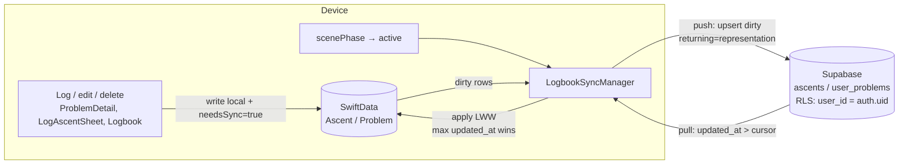
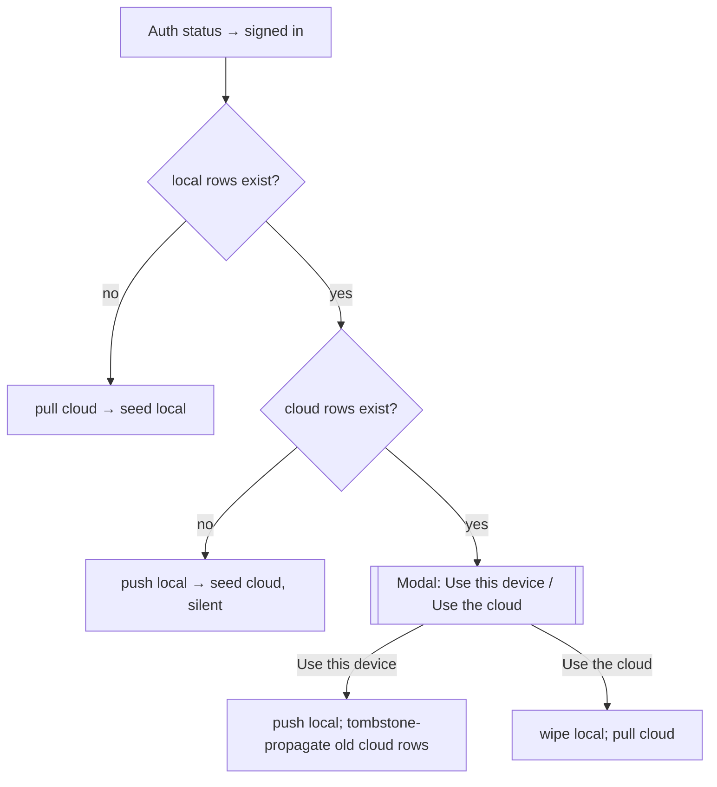

# Cloud Logbook Sync - Plan

> **Product Contract preservation:** Product Contract unchanged. ce-plan added the Planning Contract, Implementation Units, Verification Contract, and Definition of Done below without altering any resolved product decision (R1–R9, Sync & Conflict Model).

## Goal Capsule

- **Objective:** Give a signed-in user one logbook that follows them across devices — ascents (and the problems/favorites they reference) live in Supabase, offline-first, with the cloud as the convergent source of truth. This is Phase 2 of the social arc and the prerequisite for friends / shared lists (which read "who has sent what").
- **Product authority:** the user (pbs). Scope = **ascents + user-created problems** (ascents link to a real problem record, not a name string); **delete-everywhere**; **clear local cache on sign-out**; **silent last-write-wins** conflicts. All confirmed.
- **Open blockers:** login/profile milestone must be fully wired (Supabase project live, `profiles` in place) — done as of the merged PR. No ascents table or sync infra exists yet (verified: only `supabase/migrations/0001_profiles.sql`).

## Product Contract

### Primary actor & outcome
A **signed-in climber** logs and edits ascents on any device and sees the same logbook everywhere. A **signed-out climber** is unaffected — the app stays fully usable and purely local.

### In scope
- **Ascents sync** — every logged tick/attempt (sends and attempts-only) belongs to the user and converges across their devices.
- **User-created problems sync** — the `Problem` records (with holds) a user invents sync too, so an ascent references a **real problem record**, not just a name string. This makes a user-problem ascent openable/climbable on a second device and gives friends/shared-lists a real problem to point at later.
- **Proper ascent→problem linkage** — an ascent resolves its problem by a **stable ID**: catalog problems via the existing `sourceCatalogID` (shared reference data, unchanged), user-created problems via a **synced problem identity**. The denormalized name/grade snapshot stays on the ascent so a deleted problem still leaves a meaningful logbook row.
- **First-sign-in reconciliation** — a user's existing signed-out local logbook (ascents + user problems) is **preserved and becomes the seed** of their cloud data; signing in never wipes local data.
- **Offline-first writes** — logging/editing works with no network and syncs on reconnect; the local SwiftData store stays the immediate write target.
- **Delete-everywhere** — deleting an ascent (or a user problem) on one device removes it on all the user's devices (tombstones so it isn't resurrected by another device re-uploading).

### Out of scope (this milestone) — deferred, not rejected
- **Favorites sync** — deferred to a later phase (cheap; not needed for the core logbook).
- **App settings/preferences** — `@AppStorage` prefs stay device-local.
- Friends, sharing, realtime, and any cross-user reads (later phases).
- Sign in with Apple and dev/prod environment split (tracked in login SETUP doc).

### Requirements
- **R1** Signed-out behavior is byte-for-byte unchanged: BLE, catalog, local logbook, grade pyramid all work with no account.
- **R2** On first sign-in, all pre-existing local ascents and user-created problems are uploaded and attributed to the user; none are lost or duplicated, and existing ascent→problem relationships are preserved.
- **R2a** An ascent links to its problem by stable ID: `sourceCatalogID` for catalog problems, a synced problem identity for user-created ones. The ascent keeps its denormalized name/grade snapshot; if its user problem is later deleted, the ascent remains a valid logbook row (link resolves to nothing, snapshot still shows).
- **R3** Same account on multiple devices **converges**: an ascent logged on device A appears on device B; an edit on A reflects on B; a delete on A removes it on B.
- **R4** Conflicts resolve by **uniform last-write-wins on a server-authoritative `updated_at`** — see the Sync & Conflict Model below. Silent; no user-facing conflict UI.
- **R5** All writes succeed offline and reconcile automatically once online + authenticated; no user-visible sync chores.
- **R6** Deleting an ascent (or user problem) on any device removes it everywhere. Deletes are tombstones (a row flagged `deleted` with an `updated_at`), kept **indefinitely** so a long-offline device loses to the tombstone instead of resurrecting the row.
- **R7** On **Sign Out**, the on-device cached logbook (ascents + synced user problems) is **cleared** — but only after guarding unsynced work: if online, sync-then-clear; if offline with unsynced changes, warn and let the user cancel (never silently drop a logged ascent). Cloud copy untouched; re-downloads on next sign-in.
- **R8** Deleting the account (existing `delete_user()` path) removes the user's **cloud** copy and identity, but **keeps the local logbook** — the device degrades to signed-out, local-only mode. Warn first if unsynced changes exist. (Deliberately different from R7: clearing local is only safe when a cloud copy survives to restore from; delete removes that copy, so local is kept. See Sync & Conflict Model.)
- **R9** Sync is scoped per user via RLS — a user can only read/write their own rows.

### Sync & Conflict Model (resolved via grilling, 2026-07-03)
This milestone is inherently a sync-architecture decision, so the mechanism is captured here (not deferred to ce-plan):

- **Sync spine — timestamp high-water mark.** Every synced row carries a **server-authoritative `updated_at`** (stamped by Postgres on write, never the device clock) and a `deleted` flag. A device stores "last pulled at T" and pulls `WHERE updated_at > T AND user_id = me`; it pushes its own dirty rows. Survives arbitrary offline gaps; idempotent. Realtime push is deferred polish, not the mechanism.
- **Cadence — push-on-write + pull-on-foreground.** A log/edit/delete queues a push (fires immediately if online, else rides the next reconnect). The app pulls the cloud on foreground. No background refresh, no Realtime this milestone (both bolt on later without data-model changes). Retry = leave the row dirty; it rides the next push / foreground pull.
- **Uniform LWW including deletes.** Every sync keeps the version with the max `updated_at`. A delete is just a timestamped write (`deleted = true`). Consequence accepted: the winner is "last to reach the server," not "last human action" — a concurrent offline delete-vs-edit resolves by sync order. Tolerable because same-row concurrent edits on a single-user account are near-impossible.
- **Sends** (`sent == true`): immutable at creation (never merged), editable afterward (`LogAscentSheet` edit mode) — both handled by plain UUID-PK LWW.
- **Attempts** (`sent == false`, the same-day try counter): **best-effort.** A natural-key unique constraint — *(user, problem-identity, calendar-day, unsent)* — makes the cloud **upsert into one row** rather than spawn duplicates across devices. A rare concurrent-offline increment may lose a tap or two; acceptable because attempts never feed the grade pyramid or completion credit.
- **Preserve-current-behavior defaults (accepted, ce-plan to implement):** (1) an ascent's denormalized name/grade **snapshot stays frozen** at log time even if the underlying user-problem is later edited — that's the point of denormalizing; (2) logging a real send while a same-day attempt row exists **leaves both rows** in the synced logbook (they mean different things); (3) an auth token expiring mid-sync is **treated like offline** — leave rows dirty, re-auth on next foreground, then sync (RLS rejection is never data loss).
- **Deterministic attempt IDs (steady-state convergence).** Unsent attempt rows do **not** get a random UUID — their id is derived from the natural key: `id = hash(user, problem-id, calendar-day, unsent)`. Both devices independently compute the same id for the same day/problem, so there is structurally only ever **one** row (device *and* cloud); nothing to reconcile after the fact. `tries` is LWW best-effort. Sends keep random UUIDs (they legitimately repeat). The problem-identity in the key is the stable synced problem ID / `sourceCatalogID`, never the editable `problemName`.
- **Sign-in reconciliation modal (bulk first-sign-in collision).** Fires **only** when, at sign-in, *both* this device and the cloud already hold logbook data. (Common case — first sign-in on your only phone, empty cloud — stays silent: just seed local → cloud.) The modal is a **binary, wholesale winner pick — no merge:**
  - **Use this device** → local **overwrites** the cloud (cloud wiped & replaced with local).
  - **Use the cloud** → cloud **overwrites** local (local wiped & replaced with cloud).
  This trades the ability to *union* two partial histories for a guarantee of **no duplicates**. Accepted consequences: (1) the losing side's unique climbs are permanently discarded — explicit, rare; (2) "Use this device" is **account-wide destructive** — it must propagate deletions (tombstone/replace old cloud rows) so other devices converge down instead of keeping stragglers; a 3rd device's cloud-only data would be lost. Replaces the earlier "accept duplicate sends" approach.

### Success criteria
- Log an ascent on device A → it appears on device B within a normal sync cycle, and vice versa.
- Log an ascent against a **user-created** problem on device A → on device B the ascent appears **and** the problem is openable/climbable (holds present), not just a name.
- Use the app signed-out, accumulate a logbook (including user-created problems), then sign in → the whole existing logbook is now in the cloud and appears on a fresh second device.
- Go offline, log/edit/delete, come back online → changes propagate; no duplicates, no lost edits.
- Sign out then back in → logbook restores from cloud; no re-entry needed.

### Resolved decisions
- **Scope = ascents + user-created problems** (favorites + settings deferred).
- **Ascents link to a real problem record by stable ID**, retaining the denormalized snapshot for resilience (R2a).
- **Sync spine = timestamp high-water mark on server-authoritative `updated_at`.**
- **Uniform LWW including deletes; tombstones kept forever.**
- **Sends exact; attempts best-effort via natural-day-key upsert.**
- **Sign-in collision → binary "pick the winning side, wholesale" modal** (no merge; fires only when local + cloud both have data).
- **Sign-out clears local (guarding unsynced work); delete-account keeps local** — reversibility-based asymmetry.
- **Deterministic IDs for attempt rows** (natural-key derived); sends keep random UUIDs.
- **Cadence = push-on-write + pull-on-foreground** (no background/Realtime this milestone).
- **Silent conflict resolution** — no user-facing conflict UI.

### Assumptions
- The denormalized `Ascent` snapshot (name/grade) is preserved in the cloud alongside the new problem link (no full normalization) — matches the local model's "snapshot survives source deletion" intent.
- **Catalog is NOT synced to the cloud — verified 2026-07-03.** The catalog ships as bundled read-only JSON in `ios/MoonBoardLED/Resources/` (e.g. `MiniMoonBoard2025Catalog.json`), loaded via `Bundle.main` in `ios/MoonBoardLED/Catalog/Catalog.swift`. Every install of a given app version has the identical catalog, so an ascent's `sourceCatalogID` resolves locally on any device — no cloud catalog needed, and syncing ~4,900+ static problems per user would be pure duplication. The denormalized name/grade snapshot on each ascent covers any id that doesn't resolve. **Edge (accepted):** app-version drift — an ascent logged against a problem only in a newer build's bundle syncs to an older-build device and shows via its snapshot, but its holds can't open there until that device updates; self-healing. **When a cloud catalog becomes relevant:** the friends / shared-session-lists phase (a friend's app resolving shared catalog IDs) and the future PWA (no bundle on web) — both later phases, out of scope here.

### Considered and rejected
- **Force login (drop signed-out mode).** Considered as a way to sidestep sync complexity; rejected. It only removes the *merge/migration* edge cases (sign-in collision, first-sign-in seed, dual-mode) — **not** the sync engine, which is mandatory regardless because a board app is used offline at the board (BLE, gyms, basements). Costs outweigh: adoption friction (users control their own DIY hardware — a signup wall in front of BLE control is hostile), App Store Guideline **5.1.1(v)** risk (can't gate account-independent functionality behind registration), and it reverses the app's founding "no login, offline-first" principle that the social plan deliberately preserved additively. **Signed-out stays fully usable (R1).** A future **PWA** may force login on web (web users expect accounts, rarely offline mid-session) — an "optional on iOS, required on web" split, deferred.

### Outstanding questions
- None. Design tree fully resolved via grilling (2026-07-03).

---

## Planning Contract

**Target:** iOS app under `ios/MoonBoardLED/`, plus a new Supabase migration under `supabase/migrations/`. Delivery = one feature branch, units landed in dependency order (a single reviewable milestone, matching how login/profile shipped).

### Codebase grounding (verified 2026-07-03)
- **Auth hub:** `ios/MoonBoardLED/Services/Supabase/AuthManager.swift` — `@MainActor ObservableObject`, three-state `Status` machine (`signedOut` / `signedInNoProfile` / `signedInWithProfile`), owns the `SupabaseClient` (`SupabaseClientProvider.shared`, nil when unconfigured), listens to `authStateChanges`. Already has `signOut()` and `deleteAccount()` (calls `delete_user` RPC). This is where sync lifecycle hooks in.
- **Client:** `ios/MoonBoardLED/Services/Supabase/SupabaseClientProvider.swift` — vends one optional `SupabaseClient`; `SupabaseConfig` reads host/anon key from Info.plist.
- **Container:** `ios/MoonBoardLED/MoonBoardApp.swift` — `.modelContainer(for: [Problem.self, Ascent.self, FavoriteProblem.self])`. **No `ModelConfiguration`, no migration plan** — additive optional fields get automatic lightweight migration; renames/removes fatal-crash (per `docs/data-model-and-logging.md`).
- **Models:** `ios/MoonBoardLED/Models/Ascent.swift` (`Ascent` has `id: UUID`; `Problem` has **no id** — identified by name/holds today; `FavoriteProblem`). `ios/MoonBoardLED/Models/Problem.swift`.
- **Write paths (become dirty-flag + soft-delete sites):** `ProblemDetailView.swift` and `CatalogProblemDetailView.swift` (`flushPending()` / `todaysAttempt()` — same-day attempt merge), `LogAscentSheet.swift` (create + edit sends), `LogbookView.swift` (delete), user-problem create/edit/delete paths, `GradePyramidView.swift` (read filter).
- **Backend conventions (from `supabase/migrations/0001_profiles.sql`):** owner-scoped RLS via `auth.uid()`, `to authenticated`, separate select/insert/update/delete policies; `security definer` `delete_user()` deletes `auth.users` and **cascades to any table with an `on delete cascade` FK to `auth.users`** (0001's comment explicitly tells later plans to do this); DTO encoding mirrors `ProfileUpsert` (snake_case `CodingKeys`).

### Key Technical Decisions

- **KTD1 — Two cloud tables mirroring the two SwiftData models: `ascents` and `user_problems`.** Both owner-scoped, both `on delete cascade` FK to `auth.users(id)` (so the existing `delete_user()` sweeps them). `ascents.user_problem_id` is a nullable FK to `user_problems(id)`. Rationale: mirrors the local model 1:1, keeps the denormalized snapshot on `ascents` (no normalization), and the FK gives R2a's real linkage.
- **KTD2 — Server-authoritative `updated_at` via a `moddatetime`-style trigger.** `updated_at timestamptz not null default now()` + a `before update` trigger setting `updated_at = now()`. Clients never write it; upserts use PostgREST `returning=representation` to read back the server-assigned `updated_at` and advance the high-water-mark cursor. This is the load-bearing correctness decision behind the whole sync spine (R4).
- **KTD3 — Soft-delete columns, not row deletion.** `deleted boolean not null default false` on both tables; kept indefinitely (R6). Local models gain a matching `tombstoned` flag; all delete UI paths flip the flag instead of `context.delete(...)`, and all read queries filter `tombstoned == false`.
- **KTD4 — Local sync metadata as additive optional fields** (stays in automatic-migration territory): `updatedAt: Date?`, `tombstoned: Bool = false`, `needsSync: Bool = false` on both `Ascent` and `Problem`; plus `userProblemID: UUID?` on `Ascent`. **`Problem` gains `id: UUID`** — the one non-trivial migration (see Risks R-M1).
- **KTD5 — Deterministic attempt IDs.** Unsent attempt rows compute `id = UUIDv5(namespace, "\(userID)|\(problemIdentity)|\(yyyy-mm-dd)|unsent")` (problemIdentity = `sourceCatalogID` or `userProblemID`, never `problemName`). Both devices derive the same id → structurally one row, no post-hoc reconciliation. Sends keep random UUIDs. The cloud additionally carries a partial unique index as a defensive backstop.
- **KTD6 — A dedicated `LogbookSyncManager` (actor or `@MainActor` observable) owns push/pull.** Injected alongside `AuthManager`; observes auth `Status` and `scenePhase`. Uses a background `ModelContext`. Cursor (`lastPulledAt`) stored in `UserDefaults` keyed by user id. Push = upsert dirty rows; pull = `updated_at > cursor`; apply = LWW into SwiftData. Keeps all SDK/PostgREST calls out of the views (mirrors how `AuthManager` isolates auth).
- **KTD7 — Sync is strictly additive to the signed-out path (R1).** `LogbookSyncManager` is inert when `status == .signedOut` or client is nil; no view logic branches on sync for local reads. Guarantees byte-for-byte-unchanged signed-out behavior.

### High-Level Technical Design

Sync data flow (steady state, one signed-in device):

Sign-in reconciliation decision (KTD6 / R2 / modal):

---

## Implementation Units

### U1. Cloud schema + RLS migration
- **Goal:** Add `ascents` and `user_problems` tables with owner-scoped RLS, server-authoritative `updated_at`, soft-delete, the ascent→problem FK, and the defensive unsent-attempt unique index.
- **Requirements:** R2, R2a, R4, R6, R9; KTD1, KTD2, KTD3, KTD5.
- **Dependencies:** none.
- **Files:** `supabase/migrations/0002_logbook_sync.sql` (new).
- **Approach:** Follow `0001_profiles.sql` conventions exactly. `user_problems`: `id uuid primary key`, `user_id uuid not null references auth.users(id) on delete cascade`, `name text`, `grade text`, `holds jsonb not null`, `created_at timestamptz not null default now()`, `updated_at timestamptz not null default now()`, `deleted boolean not null default false`. `ascents`: `id uuid primary key`, `user_id ... on delete cascade`, all Ascent snapshot columns (`date`, `source_catalog_id text`, `problem_name`, `problem_grade`, `voted_grade`, `tries`, `stars`, `comment`, `sent`, `board_layout_id`), `user_problem_id uuid references user_problems(id) on delete set null`, `updated_at`, `deleted`. Add a `before update` trigger on both stamping `updated_at = now()`. Enable RLS; four owner policies each (`using/with check (user_id = auth.uid())`, `to authenticated`) mirroring 0001. Partial unique index: `create unique index ... on ascents (user_id, coalesce(source_catalog_id, user_problem_id::text), date_trunc('day', date at time zone 'utc')) where sent = false and deleted = false`. Add a comment noting `delete_user()` already sweeps these via the cascade FK (no RPC change needed).
- **Patterns to follow:** `supabase/migrations/0001_profiles.sql` (RLS policy quartet, `security definer` cascade note, dashboard-steps comment block).
- **Test scenarios:**
  - Apply migration on a fresh DB → both tables + policies + trigger + index exist; `\d ascents` shows the FK and defaults.
  - As user A (authenticated), insert an ascent with `user_id = auth.uid()` → succeeds; insert with another `user_id` → RLS rejects.
  - User A cannot select user B's rows (RLS isolation).
  - Update a row → `updated_at` advances to `now()` server-side without the client sending it.
  - Two inserts with the same `(user, problem, day, unsent)` key → second collides on the partial unique index.
  - Call `delete_user()` as A → A's `ascents` + `user_problems` rows are gone (cascade).
- **Verification:** migration applies cleanly via `supabase db push` / SQL editor; RLS isolation + cascade confirmed in the Table editor.

### U2. Local model: sync metadata + `Problem` identity
- **Goal:** Add sync fields to `Ascent` and `Problem`, give `Problem` a stable `id: UUID` (backfilled), and add the deterministic-attempt-id helper.
- **Requirements:** R2a, R4, R6; KTD4, KTD5.
- **Dependencies:** none (can land alongside U1).
- **Files:** `ios/MoonBoardLED/Models/Ascent.swift`, `ios/MoonBoardLED/Models/Problem.swift`, `ios/MoonBoardLED/Models/AscentSyncID.swift` (new, deterministic id helper), `ios/MoonBoardLED/MoonBoardApp.swift` (container — only if a `ModelConfiguration`/migration plan proves necessary for the `Problem.id` backfill).
- **Approach:** Add `updatedAt: Date?`, `tombstoned: Bool = false`, `needsSync: Bool = false` to both models; `userProblemID: UUID?` to `Ascent`. Add `id: UUID = UUID()` to `Problem`. **Migration care (R-M1):** verify existing `Problem` rows each get a *distinct* id under lightweight migration; if SwiftData assigns one shared default, add a `SchemaMigrationPlan` with a custom stage that stamps a fresh `UUID()` per row and backfills each ascent's `userProblemID` by matching today's name-based linkage. Deterministic id helper: `AscentSyncID.attemptID(userID:problemIdentity:day:)` using UUIDv5 over a stable namespace.
- **Execution note:** Prove the `Problem.id` backfill on a copy of a populated store *before* wiring anything else — this is the one path that can fatal-crash existing users' data.
- **Patterns to follow:** existing `@Model` definitions in `Ascent.swift`; the `boardLayoutId` defaulting comment as the model for "additive field with default for back-fill".
- **Test scenarios:**
  - Fresh install → models compile, container opens, no data.
  - Migration from a store with existing `Problem`s + ascents → every `Problem` gets a unique `id`; no fatal `DecodingError`; existing ascents' name-based linkage is preserved (and backfilled into `userProblemID` where the ascent points at a user problem).
  - `AscentSyncID.attemptID` is deterministic: same inputs → identical UUID across calls/devices; different day or problem → different UUID.
  - New optional fields default correctly on legacy rows (`updatedAt == nil`, `tombstoned == false`, `needsSync == false`).
- **Verification:** app launches on a device with a pre-existing logbook without data loss; unit test asserts deterministic-id stability.

### U3. LogbookSyncManager — push/pull engine
- **Goal:** The core sync actor: high-water-mark pull, dirty-row push, LWW apply, tombstone handling. Inert when signed out.
- **Requirements:** R3, R4, R5, R6, R9; KTD2, KTD6, KTD7.
- **Dependencies:** U1, U2.
- **Files:** `ios/MoonBoardLED/Services/Supabase/LogbookSyncManager.swift` (new), `ios/MoonBoardLED/Services/Supabase/LogbookDTO.swift` (new — Codable row DTOs with snake_case `CodingKeys`), `ios/MoonBoardLED/MoonBoardApp.swift` (instantiate + inject), `ios/MoonBoardLED/Views/RootTabView.swift` (wire `scenePhase` → `pullOnForeground`).
- **Approach:** Background `ModelContext` off the shared container. `push()`: fetch `needsSync == true` rows, upsert to `ascents`/`user_problems` with `returning=representation`, write back server `updatedAt`, clear `needsSync`. `pull()`: read `lastPulledAt` (UserDefaults, keyed by user id), fetch `updated_at > cursor` (include `deleted`), apply LWW (incoming wins iff its `updatedAt` > local; tombstone deletes/hides), advance cursor to the max `updated_at` seen. All no-ops when `status == .signedOut` or client nil (R1/KTD7). Token-expiry / RLS-rejection → treat as offline: leave rows dirty, surface nothing, retry next cycle.
- **Execution note:** Start with a failing integration test for the push→pull round-trip contract against a test Supabase project (or a mocked PostgREST) before filling in apply logic.
- **Patterns to follow:** `AuthManager`'s `requireClient()` + `@MainActor` isolation and `client.from(...).upsert(...).execute()` usage; `ProfileUpsert` DTO shape for snake_case mapping.
- **Test scenarios:**
  - Round-trip: local dirty ascent → `push()` → row in cloud with server `updatedAt`; `needsSync` cleared.
  - Pull applies a cloud row newer than local (LWW incoming wins); older cloud row is ignored.
  - Incoming `deleted = true` tombstone hides/removes the local row; a locally-held live row with an older `updatedAt` loses to the tombstone (no resurrection).
  - Deterministic attempt row: two devices push the same-day attempt → one cloud row; pulling device does not create a duplicate.
  - Cursor advances monotonically; a second `pull()` with no new server rows is a no-op.
  - `status == .signedOut` → `push()`/`pull()` do nothing (R1).
  - Auth token expired mid-push → rows stay `needsSync == true`, no crash, next cycle succeeds after re-auth.
- **Verification:** two simulator instances signed into one account converge after log→foreground; signed-out instance is unaffected.

### U4. Mutation hooks — dirty-flag on write, soft-delete
- **Goal:** Every logbook write marks the row dirty and bumps `updatedAt`; every delete becomes a tombstone; reads exclude tombstones. Triggers a push when online.
- **Requirements:** R3, R4, R5, R6; KTD3, KTD5.
- **Dependencies:** U2, U3.
- **Files:** `ios/MoonBoardLED/Views/ProblemDetailView.swift`, `ios/MoonBoardLED/Views/CatalogProblemDetailView.swift` (`flushPending()` — set `updatedAt`/`needsSync`; use `AscentSyncID` for unsent inserts), `ios/MoonBoardLED/Views/LogAscentSheet.swift` (create + edit), `ios/MoonBoardLED/Views/LogbookView.swift` (delete → `tombstoned = true`), the user-problem create/edit/delete paths, and any shared helper. Consider a small `Ascent.markDirty()` / `Problem.markDirty()` extension to avoid repetition.
- **Approach:** On every create/edit: `updatedAt = Date()`, `needsSync = true`, then ask `LogbookSyncManager` to `push()` (fire-and-forget; offline just leaves it dirty). On delete: set `tombstoned = true` + `markDirty()` instead of `context.delete(...)`. Update `todaysAttempt()` to ignore tombstoned rows and to compute/reuse the deterministic id. All logbook/pyramid fetches gain `tombstoned == false`.
- **Patterns to follow:** existing `flushPending()` insert/merge logic in `CatalogProblemDetailView.swift:342`; keep the same-day-merge semantics intact.
- **Test scenarios:**
  - Log a send → row has `needsSync == true`, fresh `updatedAt`.
  - Same-day attempt merge still produces one row and now carries the deterministic id.
  - Delete an ascent → row is tombstoned, disappears from logbook + pyramid, and syncs as a `deleted` row (not a hard local delete).
  - Editing a send bumps `updatedAt` and re-dirties.
  - Signed-out: writes still work locally, `needsSync` set but never pushed (no crash, no network).
  - `Covers` success-criterion: user-problem ascent created here carries `userProblemID`.
- **Verification:** logbook + pyramid visibly ignore tombstoned rows; deletes propagate to a second device.

### U5. Sign-in reconciliation modal
- **Goal:** On sign-in, seed silently when one side is empty; when both local and cloud hold data, present the binary "Use this device / Use the cloud" modal and execute the chosen wholesale overwrite.
- **Requirements:** R2; sign-in reconciliation modal (Sync & Conflict Model).
- **Dependencies:** U3.
- **Files:** `ios/MoonBoardLED/Services/Supabase/LogbookSyncManager.swift` (reconciliation entry + `overwriteCloudWithLocal()` / `overwriteLocalWithCloud()`), `ios/MoonBoardLED/Views/LogbookReconciliationView.swift` (new modal), `ios/MoonBoardLED/Views/RootTabView.swift` or wherever auth-driven sheets present.
- **Approach:** On auth `Status` → signed-in, `LogbookSyncManager` computes `localHasData` (any non-tombstoned local rows) and `cloudHasData` (a `head`/count query on `ascents`). Empty cloud → push-seed silently; empty local → pull-seed. Both → publish a `needsReconciliation` state the UI observes and presents `LogbookReconciliationView`. **Use this device:** tombstone-propagate all existing cloud rows (mark `deleted = true`, bump `updated_at`) then push local as authoritative. **Use the cloud:** wipe local synced rows, reset cursor, full pull. Copy must warn that the losing side's unique climbs are discarded (and "Use this device" affects other devices).
- **Patterns to follow:** `AuthManager`'s count query (`.select("id", head: true, count: .exact)`) for `cloudHasData`; existing sheet-presentation pattern used for `ProfileSetupView`.
- **Test scenarios:**
  - First sign-in, empty cloud, local data → silent push-seed, no modal.
  - Fresh device, empty local, cloud data → silent pull-seed, no modal.
  - Both sides have data → modal appears; "Use the cloud" replaces local with cloud; "Use this device" replaces cloud with local and tombstones old cloud rows.
  - After "Use this device", a third device on next pull converges down (receives tombstones) rather than keeping stragglers.
  - Modal copy states the destructive consequence.
- **Verification:** two devices with divergent signed-out logbooks; sign in on both; the chosen side wins wholesale with no duplicates.

### U6. Sign-out cache clear (guarded) + delete-account keep-local
- **Goal:** Sign-out clears the local synced cache but guards unsynced work; delete-account keeps the local logbook (reverts to local-only). 
- **Requirements:** R7, R8.
- **Dependencies:** U3.
- **Files:** `ios/MoonBoardLED/Services/Supabase/AuthManager.swift` (`signOut()`, `deleteAccount()`), `ios/MoonBoardLED/Services/Supabase/LogbookSyncManager.swift` (`clearLocalSyncedCache()`, `detachFromCloud()`, `hasUnsyncedChanges`), the Settings sign-out/delete UI for the warning prompts.
- **Approach:** `signOut()`: if `hasUnsyncedChanges` and online → `push()` then clear; if unsynced and offline → surface a confirm ("N changes haven't synced — sign out and lose them?") and only clear on confirm. Clear = delete local rows that originated from cloud sync + reset cursor. `deleteAccount()`: warn if unsynced; call existing `delete_user` RPC; then **keep** local rows but strip sync metadata (`detachFromCloud()`: clear `updatedAt`/`needsSync`/cursor so they become local-only) — device lands in `signedOut` local-only.
- **Patterns to follow:** existing `signOut()`/`deleteAccount()` in `AuthManager.swift:131`; `AuthError` for surfacing states.
- **Test scenarios:**
  - Online sign-out with dirty rows → pushes then clears; cloud has the data, local cache empty.
  - Offline sign-out with dirty rows → warning fires; cancel keeps everything; confirm clears and drops the unsynced rows (accepted).
  - Sign-out then sign back in → logbook re-downloads from cloud.
  - Delete account with dirty rows → warning; on proceed, cloud rows gone (RPC), local logbook still fully present and usable signed-out.
  - Delete account then relaunch → local-only logbook intact, no sync attempts, no crash.
- **Verification:** R7/R8 asymmetry demonstrated — sign-out empties the device (cloud safe), delete-account leaves the device's logbook intact.

### U7. Read-path tombstone filter + signed-out regression guard
- **Goal:** Ensure every logbook/pyramid read excludes tombstones and that the entire signed-out experience is byte-for-byte unchanged.
- **Requirements:** R1, R6.
- **Dependencies:** U4.
- **Files:** `ios/MoonBoardLED/Views/LogbookView.swift`, `ios/MoonBoardLED/Views/GradePyramidView.swift`, `ios/MoonBoardLED/Board/BoardFilter.swift` (if it filters ascents), any `FetchDescriptor<Ascent>`/`@Query` for ascents or user problems.
- **Approach:** Audit every `@Query`/`FetchDescriptor` over `Ascent`/`Problem` and add `tombstoned == false`. Confirm no read path or signed-out code branch depends on the sync manager. This is largely a filter sweep + a regression pass.
- **Execution note:** Mostly a query-audit sweep; prioritize a signed-out smoke pass over new unit coverage.
- **Test scenarios:**
  - Tombstoned ascent never appears in logbook, sessions, or pyramid.
  - Grade pyramid dedupe/earliest-send logic still correct with tombstones excluded.
  - Signed-out full smoke: BLE connect, browse catalog, log a send + attempts, view logbook + pyramid — all identical to pre-change behavior (R1).
- **Verification:** signed-out build behaves exactly as before; tombstones invisible everywhere.

---

## Verification Contract

- **Build/typecheck:** app compiles for a real device target (BLE needs hardware; sync + auth work in Simulator).
- **Migration safety gate (blocking):** launch a build over a pre-existing populated logbook store → no data loss, no fatal `DecodingError`, every `Problem` gets a unique id. This gates everything else.
- **Convergence:** two Simulator instances signed into one account; log/edit/delete on one → appears on the other after foreground.
- **Offline:** airplane-mode a device, log/edit/delete, reconnect → changes propagate; no duplicates, no lost edits.
- **Sign-in collision:** two divergent signed-out logbooks → sign in on both → chosen side wins wholesale, no duplicates.
- **Lifecycle:** sign-out empties the device and re-downloads on re-sign-in; delete-account keeps local, removes cloud.
- **RLS isolation:** a second account cannot read the first's rows (verified in Supabase Table editor).
- **Signed-out regression (blocking):** full signed-out smoke pass unchanged (R1).

## Definition of Done

- All 7 units landed on one feature branch; migration `0002_logbook_sync.sql` applied to the Supabase project.
- Every Verification Contract gate passes, with the two blocking gates (migration safety, signed-out regression) explicitly green.
- No hard `context.delete` remains on any synced logbook path (all deletes are tombstones).
- `docs/social-accounts-login-SETUP.md` (or a sibling) updated with the one manual step this adds: apply the new migration.
- `docs/data-model-and-logging.md` updated to document the new sync fields, `Problem.id`, tombstones, and deterministic attempt ids.

---

## Risks & Mitigations

- **R-M1 — `Problem.id` backfill under a no-migration-plan container (highest risk).** Adding a non-optional `id: UUID` to an existing `@Model` may assign a shared default or fail. *Mitigation:* treat U2 as gated by the migration-safety test on a copy of a populated store; if lightweight migration misbehaves, add an explicit `SchemaMigrationPlan` stage that stamps per-row UUIDs and backfills `userProblemID`. Never ship until a populated-store launch is proven clean.
- **R-M2 — Server/client clock for LWW.** `updated_at` is server-set, so "last write" = last to sync, not last edited (accepted in the Sync & Conflict Model). No mitigation needed; documented so a future reader doesn't "fix" it into client timestamps and reintroduce skew bugs.
- **R-M3 — "Use this device" is account-wide destructive.** Overwriting the cloud must tombstone-propagate so other devices converge down; a bug here silently loses a third device's cloud-only data. *Mitigation:* U5 test explicitly covers third-device convergence; consider a future export before enabling wider multi-device use.
- **R-M4 — Deterministic-id key stability.** If the key ever incorporates a mutable field (e.g., `problemName`), same-day attempts would fork. *Mitigation:* key uses only `sourceCatalogID`/`userProblemID` + UTC day; unit test pins determinism (U2).
- **R-M5 — Timezone in the day-key.** Client and server must agree on "calendar day." *Mitigation:* fix the day bucket to a single convention (UTC) in both `AscentSyncID` and the SQL partial index; document it.

---
*Enriched by ce-plan 2026-07-03 from the ce-brainstorm requirements + grilled design tree. Product Contract preserved verbatim.*
