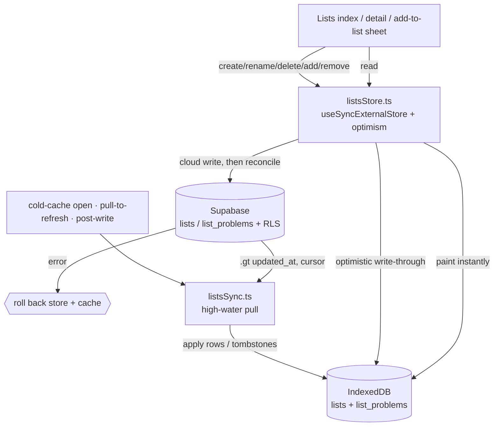

# Web Saved Lists - Plan

> **Product Contract preservation:** product intent unchanged; **KTD8's *mechanism* was
> corrected** during planning (its `upsert`-on-partial-index recipe is infeasible — Postgres
> 42P10 — so the "one live row / re-add works" intent is preserved but the how changed; see
> KTD8 and KTD-I3). Everything else in the Goal Capsule, Product Contract (R1–R4, KTD1–8),
> Non-goals, and Success signals is the `ce-brainstorm` output verbatim. Everything from
> **Planning Contract** onward is the added implementation plan.

## Goal Capsule

- **Objective:** Bring **Saved Lists** to the web PWA — named, cloud-backed collections of
  catalog problems — as a port of the feature already shipped on iOS. The backend already
  exists on `main` (migration `0003`); this is the web client for it, plus a web-only offline
  read layer.
- **Product authority:** the user (solo climber curating problems). Product decisions below
  were resolved in a `ce-brainstorm` → `/grill-me` session on 2026-07-06.
- **Open blockers:** none. Web auth + Supabase client are already on `main`
  (`web/src/auth/`, `web/src/supabase/client.ts`); migration `0003` is applied. No schema change.

## Context — what already exists

- **Backend (done, shared):** `supabase/migrations/0003_collaborative_lists.sql` on `main` —
  `lists`, `list_members`, `list_problems`, RLS, the `is_list_member` helper, and the
  owner-seat trigger. A **personal list is a cloud list with one member (you)**, seated by that
  trigger. Tables carry `updated_at` + a `deleted` tombstone, "for cheap read-through."
- **iOS (done):** the full feature (`ios/.../Views/Lists/*`, `ListsManager`, `ListsDTO`) is
  built against `0003`. Same account → same lists cross-platform. iOS is **cloud-only**.
- **Companion plan:** [`2026-07-04-002-feat-saved-lists-plan.md`](2026-07-04-002-feat-saved-lists-plan.md)
  is the iOS delivery of this feature; it owns the backend-extraction rationale. This doc is the
  **web** counterpart and does not restate it.
- **Web has none of it yet.** The web client (TS) must talk to Supabase directly — it cannot
  reuse the Swift `ListsManager`.

## Product Contract

### Core

- **R1 — CRUD lists.** A signed-in user can **create**, **rename** (inline), and **delete**
  (with a confirm) Saved Lists from a Lists surface. Delete is a soft-delete (`deleted`).
- **R2 — Membership CRUD.** Open a list to see its problems; **add** a catalog problem;
  **remove** it (soft-delete).
- **R3 — Add-to-list entry point.** A bookmark / list-plus **icon in the problem-detail
  top-right action cluster** (beside the favorite heart) opens an **add-to-list sheet**:
  - shows only the user's lists **for the current board**, each with a membership **checkmark**
    (tap toggles add/remove, optimistic);
  - a **"New list"** row that takes a name, creates the list (bound to the current board), and
    **immediately adds the current problem** to it;
  - an empty state ("Create your first list") when there are no lists for this board.
- **R4 — Navigation.** Deep-linkable top-level **`/lists`** (index of your lists, newest-first,
  each labeled with its board) and **`/lists/$listId`** (detail), added to `AppLayout` nav
  beside Logbook. List detail offers an **angle filter/grouping** (each problem carries its
  angle). Tapping a problem opens the existing detail pager.

### Board scope

- **KTD1 — Board-scoped, not angle-scoped.** A list binds to exactly one board
  (`board_layout_id`), fixed at creation. **No angle scope** — a list may hold problems of any
  angle; angle is a filter *inside* list detail. (Matches the schema and iOS; avoids a backend
  fork.)
- **KTD2 — Bind to the catalog board in context.** A list created from a problem binds to the
  board whose catalog the user is viewing (the route's `layoutId`), which equals the global
  active board in the normal case and stays correct when a public catalog deep-link put the
  user on a different board.

### Cloud & auth

- **KTD3 — Cloud + sign-in required.** Lists are an account feature (like the cloud logbook).
  Signed-out `/lists` shows a sign-in prompt; a signed-out add-to-list tap opens the existing
  `SignInDialog`. **On sign-in success, resume the interrupted action** — reopen the
  add-to-list sheet on the same problem.
- **KTD4 — List URLs are RLS-protected, not capabilities.** `/lists/$listId` is safe to share
  or leak: `0003`'s "Members read their lists" policy returns zero rows to a non-member, so the
  app shows "not found." Access is by identity, never by knowing the id. (Future sharing uses a
  separate `invite_token` secret.)

### Offline (web-only, beyond iOS)

- **KTD5 — Offline read.** Sync `lists` + `list_problems` into **IndexedDB** using the
  catalog's incremental high-water-mark pattern (`updated_at` cursor, apply `deleted`
  tombstones). A signed-in user can **view lists and light up problems fully offline**.
- **KTD6 — Writes need network.** Add/remove/create are **optimistic** (update local +
  IndexedDB immediately, then the cloud write); on network failure, **roll back and toast** a
  retry. No offline authoring / mutation queue in v1.
- **KTD7 — Sync timing: cached-first, explicit-refresh.**
  - **Cold cache** (never synced) → open Lists does one automatic pull.
  - **Warm cache** → open Lists shows cached lists **instantly, no network**; re-sync only on
    **pull-to-refresh** or **after a write**. No background/foreground/sign-in auto-poller.
  - Cross-device edits appear on next pull-to-refresh or reconnect.

### Data correctness

- **KTD8 — Re-add revives the existing row (schema guarantees single-*live*, not single-row).**
  `list_problems` has a **partial** unique index `(list_id, source_catalog_id) WHERE deleted =
  false` — it enforces at most one *live* row but permits accumulated tombstones. Re-adding a
  removed problem must **explicitly revive**: `UPDATE … SET deleted=false, added_by,
  updated_at` on that key, and `INSERT` only if no row matched. A PostgREST
  `upsert(onConflict:'list_id,source_catalog_id')` **cannot** target a partial index (Postgres
  42P10) — do not use it. Result: at most one live entry per (list, problem); historical
  tombstones may remain, which is acceptable. Set `board_layout_id` consistently with iOS.
  Cross-check the shipped iOS `ListsManager` (companion plan 2026-07-04-002) — it solves this
  same partial-index re-add.

### Defaults (stated, low-stakes)

- No hard cap on number of lists or problems-per-list in v1. List name trimmed, capped ~60
  chars for UI. **Duplicate list names allowed** (id is the key).

## Non-goals (this phase)

- **Sharing / collaboration** — members, invites, group status, the group-lens catalog.
  Deferred with migrations `0004`/`0005` (a personal list is already collaboration-ready:
  one-member now, add members later). Out of scope here.
- **Favorites view.** Favorites is untouched and stays reachable as the existing **catalog
  favorites filter**; no separate Favorites surface in the web Lists port (unlike iOS).
- **Ordering.** Lists are unordered membership now; manual ordering deferred.
- **Sessions.** A live "queue problems and run them on the wall" concept is a **separate future
  feature**, distinct from Lists (a List may later *feed* a Session). Not designed here.
- **Offline authoring / mutation queue**, background/periodic sync.

## Success signals

- Signed in: create → rename → delete a list; add/remove problems; all persist across a reload
  and appear on iOS on the same account.
- Add-to-list from a problem works, including "New list" that saves the current problem.
- Signed out: `/lists` and add-to-list prompt for sign-in, then resume.
- Offline (signed in, cache warm): lists and their problems load and light up with no network;
  a write while offline rolls back with a toast.

---

## Planning Contract

**Depth:** Standard (bounded feature, but a genuinely new surface: cloud user-data that is
*also* offline-cached — a combination no existing web module has). **Plan type:** `feat`.
All work is in `web/`; no schema change (migration `0003` already on `main`).

**Load-bearing precedents (mirror these, don't invent):**
- **`web/src/logbook/ascents.ts`** — the TS analog of an iOS sync manager: module-level
  `state` + `Set<listeners>` + `useSyncExternalStore`, a status enum, snake_case row interface
  + pure `fromRow()`, signed-out/unconfigured guard, and **optimistic upsert with rollback**
  (`const prev = state.x; setState(optimistic); const {error} = await supabase…; if (error)
  { setState({x: prev}); throw }`). Online-only — no cache.
- **`web/src/catalog/catalogSync.ts`** — the IndexedDB template: `openDB()` with
  `onupgradeneeded` object stores, a localStorage **high-water cursor**, incremental
  `.gt('updated_at', cursor).order('updated_at')` pulls that `store.put`/`store.delete` by
  the `deleted` tombstone, best-effort (on throw: cursor untouched, return cache).
- **`web/src/catalog/useSlab.ts`** — per-key `useState`+`useEffect` reactive read (cached
  paint → best-effort delta → `degraded` flag). The fit for list **detail** (keyed by listId).
- **`web/src/logbook/LogbookScreen.tsx`** — the signed-out/`isRestoring`/loading/empty/error
  render ladder and inline `SignInPanel` card. The fit for the Lists **index**.
- **`web/src/logbook/LogAscentSheet.tsx`** — the `Drawer` sheet mirror (there is **no**
  shadcn `Sheet`; the repo uses `web/src/components/ui/drawer.tsx`, base-ui, files named
  `*Sheet.tsx` by convention).

## Key Technical Decisions (implementation)

- **KTD-I1 — One `web/src/lists/` module, two stacked patterns.** A new `lists/` dir holds a
  pure types/mappers file, an IndexedDB sync file (catalog pattern), and a reactive store
  (ascents pattern) layered on top. This is the first web module to combine cloud CRUD with an
  offline cache; keep the seam clean (sync layer owns IndexedDB + cursors; store layer owns
  cloud writes + optimism + subscription).
- **KTD-I2 — Global store for the index, per-key hook for detail.** "My lists" is a global
  collection → `useSyncExternalStore` store (ascents shape). A single list's problem pile is
  keyed by `listId` → `useSlab`-style `useState`+`useEffect` read from the cache.
- **KTD-I3 — Cached-first read, write-through, explicit revive** (implements KTD5–8):
  reads paint from IndexedDB instantly (cold cache → one auto pull; warm → explicit refresh /
  post-write only); every mutation is optimistic against store **and** IndexedDB, then the
  Supabase write, rolling back both on error; re-add is an **explicit revive** — `update … set
  deleted=false` on the `(list_id, source_catalog_id)` row, falling back to `insert` when none
  matched (a PostgREST `upsert` can't target the partial index — KTD8).
- **KTD-I4 — Board binding = catalog-route board.** The list's `board_layout_id` is taken
  from the catalog context the create happens in (the route's `layoutId`), which equals
  `getActiveBoardId()` in the normal case (implements KTD2). Add-to-list shows only lists whose
  `board_layout_id` matches the current problem's board.
- **KTD-I5 — Derive a short board label; no schema/field change.** `CatalogBoardDef` has no
  `shortName`; add a small pure `boardShortLabel(name)` helper in `lists/` for index rows and
  the sheet header. Not a board-registry change.
- **KTD-I6 — Adding `/lists` is a real nav layout change.** `Navigation.tsx` currently assumes
  two home tabs (Boards/Logbook) left + Search right. Add a third `ListsTab`; the small
  left-cluster layout adjustment is in scope and owned by U4.
- **KTD-I7 — Test at pure-mapper + store-reducer seams.** `ascents.ts` is untested and there
  is no established supabase-write test pattern. Keep row mappers and the store's
  state-reducer pure and unit-test those directly; consumers mock the `lists` module at its
  boundary (as `useSlab.test.ts` mocks `catalogSync`). Establish this pattern here.
- **KTD-I8 — Writes set the RLS identity columns explicitly.** `0003`'s insert policies
  require `owner_id = auth.uid()` (lists) and `added_by = auth.uid()` (list_problems) — both
  NOT NULL, no default. `createList` sets `owner_id`, `addProblem`/revive sets `added_by`, from
  `currentUserId()` (mirroring how `ascents.ts` sets `user_id`). Omitting them fails the RLS
  `WITH CHECK` / NOT NULL at runtime.
- **KTD-I9 — Cache lifecycle is bound to the auth identity, not a screen.** The IndexedDB
  cache persists one user's private lists, so `resetLists()` (clear store + `clearListsCache`)
  fires from the global auth transition in `AuthProvider` (`onAuthStateChange`) on sign-out
  **and on any change of signed-in user id** — not from a screen-mount effect like
  `LogbookScreen`'s `resetAscents()` (safe only because ascents is in-memory). Otherwise, on a
  shared device, user B opens `/lists` with a warm cache and sees user A's cached lists.
  `clearListsCache` must complete before the next user's `loadLists` runs.
- **KTD-I10 — Never cache the share secret.** `invite_token` is the capability secret
  `0004`'s join RPC trades for membership; sharing is out of scope. The sync projection selects
  only the columns the client uses (`id, owner_id, name, board_layout_id, created_at,
  updated_at, deleted`) and **never** persists `invite_token` to IndexedDB.

## High-Level Technical Design

Read/write data flow across the three layers (store → cache → cloud):

Read freshness state (KTD7): **cold cache** (no localStorage cursor) → auto pull on first
Lists open; **warm cache** → paint from IndexedDB, no network, until an explicit refresh or a
write triggers a `listsSync` pull.

---

## Implementation Units

### U1. Lists types + pure mappers + board label helper

- **Goal:** The pure foundation every other unit imports — row interfaces, domain types, and
  side-effect-free mappers, fully unit-testable with no Supabase or IndexedDB.
- **Requirements:** R1, R2, KTD1, KTD8, KTD-I1, KTD-I5, KTD-I7, KTD-I10.
- **Dependencies:** none.
- **Files:** `web/src/lists/listsTypes.ts`, `web/src/lists/listsTypes.test.ts`.
- **Approach:** `ListRow` / `ListProblemRow` snake_case interfaces matching `0003` — but
  `ListRow` **excludes `invite_token`** (KTD-I10; sharing is out of scope and it must not reach
  the cache): `id, owner_id, name, board_layout_id, created_at, updated_at, deleted` and
  `id, list_id, source_catalog_id, board_layout_id, added_by, created_at, updated_at,
  deleted`. Domain types `SavedList` / `SavedListProblem`. Pure `fromListRow` /
  `fromListProblemRow`. `boardShortLabel(name: string): string` (KTD-I5). `trimListName(raw)`
  → trimmed, capped ~60 chars.
- **Patterns to follow:** the row-interface + `fromRow` shape in `ascents.ts`.
- **Test scenarios:**
  - `fromListRow` maps a full row incl. `deleted` and `board_layout_id`.
  - `fromListProblemRow` maps a row; preserves `source_catalog_id` and `added_by` null.
  - `boardShortLabel('Mini MoonBoard 2025')` returns a compact label; unknown/empty → sane
    fallback.
  - `trimListName`: trims whitespace; caps at the max length; empty → empty (caller rejects).
- **Verification:** unit tests green; no import of `supabase`/`indexedDB` in this file.

### U2. IndexedDB cache + incremental high-water sync (`listsSync.ts`)

- **Goal:** Offline durability — cache `lists` + `list_problems` in IndexedDB and pull deltas
  incrementally, applying tombstones. Best-effort; never throws to the caller.
- **Requirements:** R2, KTD5, KTD7, KTD8, KTD-I1, KTD-I3, KTD-I10.
- **Dependencies:** U1.
- **Files:** `web/src/lists/listsSync.ts`, `web/src/lists/listsSync.test.ts`.
- **Approach:** Mirror `catalogSync.ts`. `openDB()` with two object stores — `lists`
  (`keyPath: 'id'`) and `list_problems` (`keyPath: 'id'`, secondary index
  `createIndex('list', 'list_id')`). Two localStorage high-water cursors
  (`listsCursor`, `listProblemsCursor`). `syncLists(userId)`: for each table
  `.select('<explicit columns — NOT *, exclude invite_token>').gt('updated_at',
  cursor).order('updated_at', {ascending:true})` (KTD-I10), apply in a `readwrite`
  tx (`row.deleted ? store.delete(pk) : store.put(row)`), advance cursor only if rows
  returned. `readLists()` → all non-deleted lists; `readListProblems(listId)` via the `list`
  index. On any throw: cursors untouched, return cache, `synced:false`. `clearListsCache()`
  for sign-out. Reuse the `txDone`/`requestResult` promisify helpers' shape.
- **Patterns to follow:** `catalogSync.ts` (`openDB`, cursor, apply loop, best-effort return).
- **Execution note:** the tombstone-apply and cursor-advance-only-on-rows logic is the bug-prone
  core — cover it test-first.
- **Test scenarios:**
  - Cold cache (no cursor): pull applies rows, advances both cursors, `readLists` returns them.
  - Incremental: a second pull with a newer `updated_at` row updates only that row; cursor moves.
  - Tombstone: a row with `deleted:true` deletes it from the store; it's gone from `readLists`.
  - Empty delta (no rows): cursor unchanged; cache intact.
  - `readListProblems(listId)` returns only that list's live problems (index scoped).
  - Supabase error mid-pull: cursor not advanced; prior cache still readable; `synced:false`.
  - `clearListsCache` empties both stores and clears cursors.

### U3. Reactive lists store + optimistic CRUD (`listsStore.ts`)

- **Goal:** The `ListsManager` equivalent — reactive "my lists", cached-first load, and
  optimistic create/rename/delete/add/remove with rollback and write-through.
- **Requirements:** R1, R2, KTD3, KTD5, KTD6, KTD7, KTD8, KTD-I2, KTD-I3, KTD-I4, KTD-I7,
  KTD-I8, KTD-I9.
- **Dependencies:** U1, U2.
- **Files:** `web/src/lists/listsStore.ts`, `web/src/lists/listsStore.test.ts`,
  `web/src/auth/AuthProvider.tsx` (wire `resetLists` into the auth transition — KTD-I9).
- **Approach:** Mirror `ascents.ts`. Module `state` (`{ status, lists }`,
  `status: 'idle'|'loading'|'loaded'|'error'|'offline'`), `Set<listeners>`, `setState`,
  `subscribe`, `getSnapshot`, `export function useSavedLists()`. Add an **`offline`** status
  distinct from `error`/`loaded` (D2): a cold-cache load whose pull fails with nothing cached
  lands in `offline`, so the screen can tell "no lists" from "couldn't reach your lists."
  `loadLists()`: paint from `readLists()` immediately; if cold cache → `await syncLists` then
  repaint (→ `offline` if the pull failed and cache is empty); if warm → no auto network.
  `refreshLists()` (explicit) → `syncLists` + repaint. `currentUserId()` via `getSession()`
  like `ascents.ts`. Mutations, each optimistic against store + IndexedDB then Supabase,
  rollback both on error, reconcile server row:
  `createList(name, boardLayoutId)` — **sets `owner_id = currentUserId()`** (KTD-I8), binds
  `board_layout_id` from the caller (KTD-I4);
  `renameList(id, name)` (`.update({name}).eq('id', id)`);
  `deleteList(id)` (`.update({deleted:true})`);
  `addProblem(listId, sourceCatalogId, boardLayoutId)` — **explicit revive** (KTD8): `update
  … set deleted=false, added_by = currentUserId(), updated_at` on `(list_id,
  source_catalog_id)`; if zero rows matched, `insert` with `added_by = currentUserId()`
  (KTD-I8). **Not** a PostgREST upsert;
  `removeProblem(listId, sourceCatalogId)` (soft-delete update).
  `resetLists()` (clear store + `clearListsCache`) — **invoked from `AuthProvider`'s
  `onAuthStateChange`** on sign-out and on any signed-in user-id change (KTD-I9), not from a
  screen effect; awaits `clearListsCache` before any next-user `loadLists`. Signed-out/
  unconfigured guard like `ascents.ts`.
- **Patterns to follow:** `ascents.ts` optimistic-write-with-rollback + `useSyncExternalStore`;
  `ascents.ts` `currentUserId()`/`user_id` for the identity columns.
- **Execution note:** implement the rollback path and the explicit-revive add test-first;
  they're the correctness heart.
- **Test scenarios:**
  - `loadLists` cold cache: triggers a sync, ends `loaded` with rows.
  - `loadLists` warm cache: paints cached rows without a network pull.
  - `loadLists` cold cache + pull fails + empty cache: ends `offline` (not `loaded`/`error`).
  - `createList`: optimistic list appears immediately; sets `owner_id`; server reconcile
    replaces temp id.
  - `createList` cloud error: optimistic row rolled back; store returns to prior; throws.
  - `renameList` / `deleteList`: optimistic apply then persist; error rolls back.
  - `addProblem` sets `added_by`; then `removeProblem` then `addProblem` (same problem): ends
    with exactly one live membership via explicit revive — no partial-index violation, no
    second live row. Covers KTD8.
  - `addProblem` on a never-before-added problem inserts a new row (revive matched zero).
  - `removeProblem` error: problem reappears (rollback).
  - `resetLists`: store empty and cache cleared.
  - **Cross-account (KTD-I9):** sign out as user A then in as user B → the cache is cleared and
    B's first `loadLists` is a cold pull, never painting A's lists.

### U4. Routes + nav shell for `/lists`

- **Goal:** Make Lists reachable and deep-linkable, with a home-nav tab.
- **Requirements:** R4, KTD-I6.
- **Dependencies:** none (scaffold the routes/nav with placeholder screen components; U5/U6
  replace the placeholders — those units depend on U4, not the reverse, so the sequencing is
  acyclic).
- **Files:** `web/src/router.tsx`, `web/src/shell/AppLayout.tsx`,
  `web/src/shell/Navigation.tsx`, `web/src/shell/Navigation.test.tsx`,
  `web/src/router.test.tsx`.
- **Approach:** Add `listsRoute` (`/lists` → `ListsScreen`) and `listDetailRoute`
  (`/lists/$listId` → `ListDetailScreen`) mirroring `logbookRoute`; register both in
  `rootRoute.addChildren([...])`. Extend `NavView`/`HomeView` with `'lists'`; add the `'lists'`
  case to `AppLayout`'s `go()` and `matchRoute` mapping. Add a `ListsTab` in `Navigation.tsx`
  (mirror `LogbookTab`, a lucide list/bookmark icon). **Decide the collapse/origin behavior,
  not just spacing (D1):** `Navigation` collapses to a single *origin* home tab + Search on the
  catalog, and `HomeView`/`origin` currently has two members. Specify whether Lists is a valid
  catalog-search **origin** (i.e. you can reach the catalog *from* Lists and the collapsed bar
  shows the Lists origin) or is **home-only** (recommended: home-only — Lists doesn't open the
  catalog, so it never becomes an origin; the collapsed bar is unaffected). Then lay out three
  home tabs left + Search right explicitly.
- **Patterns to follow:** `logbookRoute` in `router.tsx`; `LogbookTab`/`TabButton` and the
  `origin`/`HomeView` collapse logic in `Navigation.tsx`.
- **Test scenarios:**
  - `renderWithRouter('/lists')` renders the index screen.
  - `renderWithRouter('/lists/abc')` renders the detail screen for `abc`.
  - `Navigation` shows the Lists tab and marks it active on a `/lists*` route.
  - The collapsed catalog bar behaves per the chosen origin rule (Lists home-only → catalog
    origin unchanged when the user came via Lists).
  - Unknown/`/lists` while signed out still routes (screen owns the sign-in prompt).

### U5. Lists index screen (`ListsScreen.tsx`)

- **Goal:** Browse, create, rename, delete your lists; handle signed-out / loading / empty /
  error / offline.
- **Requirements:** R1, R4, KTD3, KTD7, KTD-I4.
- **Dependencies:** U3, U4.
- **Files:** `web/src/lists/ListsScreen.tsx`, `web/src/lists/ListsScreen.test.tsx`.
- **Approach:** Mirror `LogbookScreen`'s render ladder: gate on `isRestoring`; signed-out →
  inline `SignInPanel` card ("Sign in to save lists"); loading skeleton; else list rows (name +
  `boardShortLabel` + live problem count, newest-first). **Distinguish empty from offline
  (D2):** `status === 'loaded'` with zero rows → the create-first-list empty state;
  `status === 'offline'` (cold-cache pull failed, nothing cached) → a distinct "Can't reach
  your lists — you're offline" state with a retry, **not** "Create your first list" (which
  would wrongly imply the user has no lists). Create via an inline name field (binds board to
  `getActiveBoardId()`, since the index is board-agnostic — KTD-I4); rename inline; delete via
  a confirm (`Drawer`/dialog). A pull-to-refresh / refresh affordance calls `refreshLists()`.
- **Patterns to follow:** `LogbookScreen.tsx` (ladder, `SignInPanel`, `EmptyState`/`ErrorNote`).
- **Test scenarios:**
  - Signed out: shows the sign-in card, not the list UI.
  - Loaded with lists: rows render name + board label + count, newest first.
  - Loaded + zero rows: shows the create-first-list empty state.
  - `offline` status: shows the "can't reach your lists" state with retry, NOT the empty state.
  - Create: entering a name adds a row (optimistic); blank name rejected.
  - Rename inline updates the row; delete asks to confirm then removes it.
  - Error status surfaces an error note (not a blank screen).

### U6. List detail screen (`ListDetailScreen.tsx`)

- **Goal:** Open one list: its problems, an angle filter, remove, and tap-through to the pager.
- **Requirements:** R2, R4, KTD1, KTD4.
- **Dependencies:** U3, U4.
- **Files:** `web/src/lists/ListDetailScreen.tsx`, `web/src/lists/ListDetailScreen.test.tsx`,
  `web/src/lists/useListProblems.ts` (per-key cache read).
- **Approach:** `useListProblems(listId)` (KTD-I2: `useSlab`-style read from `readListProblems`
  + best-effort refresh). Resolve each `source_catalog_id` to a catalog problem for the list's
  board (reuse the catalog index/slab used elsewhere). Header shows list name +
  `boardShortLabel`. **Angle filter/grouping** (KTD1): a pill/segment over the angles present
  in the pile; each problem row shows its angle. Remove a problem (`removeProblem`, optimistic).
  Tapping a problem opens the existing detail pager; **the pager's `displayed` domain is the
  currently-shown (angle-filtered) subset** — so prev/next never jumps to a problem the active
  filter hides, matching how the catalog pager scopes to its filtered list. Not-found /
  RLS-empty (`/lists/$listId` for a non-member) → a "list not found" state (KTD4).
- **Patterns to follow:** `useSlab.ts` per-key read; `CatalogList`/`ProblemDetail` for rows +
  pager.
- **Test scenarios:**
  - Renders list name, board label, and its problems.
  - Angle filter narrows the shown problems to the selected angle; "all" shows every angle.
  - With an angle filter active, the pager's prev/next stays within the filtered subset (never
    pages to a hidden-angle problem).
  - Remove a problem drops it from the pile (optimistic); reappears on error.
  - Unknown/other-user listId → "list not found", no crash.
  - Empty list → an empty state, not an error.

### U7. Add-to-list entry point (`AddToListSheet.tsx` + problem-detail button)

- **Goal:** Save the problem you're looking at into a list, with in-context create and
  sign-in resume.
- **Requirements:** R2, R3, KTD2, KTD3, KTD-I4.
- **Dependencies:** U3.
- **Files:** `web/src/lists/AddToListSheet.tsx`, `web/src/lists/AddToListSheet.test.tsx`,
  `web/src/catalog/ProblemDetail.tsx` (add the trigger), `web/src/components/ui/sonner.tsx`
  + a `<Toaster>` mount in `web/src/shell/AppLayout.tsx` (the write-failure toast surface).
- **Approach:** A bookmark / list-plus icon `Button` in `ProblemDetail`'s top-right action
  cluster (beside the favorite `Heart`, distinct glyph). Opens a `Drawer` sheet
  (`LogAscentSheet` mirror): lists whose `board_layout_id` matches this problem's board
  (`board.layoutId` from the detail props — KTD-I4), each with a membership **checkmark**
  toggling `addProblem`/`removeProblem` (optimistic). A **"New list"** row: inline name →
  `createList(name, board.layoutId)` then `addProblem` for the current problem, shown checked.
  Empty state → "Create your first list". Signed-out tap → open `SignInDialog`; **on sign-in
  success, reopen the sheet on the same problem** (KTD3 resume). **Write-failure toast (D3):**
  KTD6's "roll back and toast a retry" has no home today — `ascents.ts` surfaces errors as an
  inline `ErrorNote` in `LogbookScreen`, but add/remove happen inside this sheet/detail with no
  inline note. Add a shadcn **`sonner` toaster** (`npx shadcn add sonner`), mount `<Toaster>`
  once in `AppLayout`, and on a rolled-back mutation show a toast with a **Retry action** that
  re-invokes the same mutation. U3/U5 reuse the same toaster.
- **Patterns to follow:** `LogAscentSheet.tsx` (`Drawer` shell); `ProblemDetail`'s existing
  `SignInDialog` + `signInOpen` state and top-right `Button` cluster.
- **Test scenarios:**
  - Signed in: sheet lists only current-board lists; checkmark reflects membership.
  - Toggling a list adds/removes the problem (optimistic); on error, rolls back and shows a
    toast whose Retry action re-runs the mutation.
  - "New list" creates a board-bound list and adds the current problem, shown checked.
  - Blank new-list name rejected.
  - Signed out: tapping the icon opens `SignInDialog`; after sign-in the sheet reopens on the
    same problem. Covers KTD3 resume.
  - The icon is visually distinct from the favorite heart (a11y label present).

---

## Verification Contract

- **Prereq:** migration `0003_collaborative_lists.sql` is already applied to the Supabase
  project (it backs iOS). Confirm before manual testing; no new migration ships here.
- **Gates (green per PR):** `cd web && npm run lint`, `npm run build`, `npm test`.
- **Manual (signed in):** create → rename → delete a list; add a problem from the detail sheet
  → appears in the list; remove → gone; re-add the same problem → single live entry (KTD8);
  all survive a reload (cloud) and appear on iOS for the same account.
- **Manual (offline read):** with a warm cache, go offline → `/lists` and a list's problems
  still render and light up; a write while offline rolls back with a **Retry toast** (KTD6). A
  cold cache while offline shows the "can't reach your lists" state, **not** "create your first
  list" (D2).
- **Manual (cold cache):** fresh sign-in / new device → first `/lists` open auto-loads
  (KTD7); a subsequent reopen paints instantly with no network until refresh.
- **Manual (auth):** signed-out `/lists` and add-to-list show the sign-in prompt; sign-in from
  the sheet resumes the add (KTD3). A `/lists/$listId` for a non-member shows "not found"
  (KTD4).
- **Manual (shared device — KTD-I9):** sign in as user A, view lists; sign out; sign in as
  user B → B never sees A's lists (cache cleared, cold pull). Confirm `invite_token` is absent
  from the IndexedDB rows (KTD-I10).

## Definition of Done

A signed-in user can create / rename / delete board-bound Saved Lists on the web PWA, add and
remove catalog problems from the problem-detail sheet (with in-context create and sign-in
resume), browse them at deep-linkable `/lists` + `/lists/$listId` with an angle filter, and —
with a warm cache — read their lists and light up problems fully offline; writes are optimistic
with rollback; re-adding a removed problem yields a single live row; all gates green and lists
consistent with iOS on the same account. No sharing/members/Favorites-view UI on screen.

## Open Questions (execution-time)

- Exact IndexedDB `DB_NAME`/`DB_VERSION` and whether to reuse the catalog DB or a separate one
  (decide at U2 — a separate DB is cleaner and lower-risk).
- Visual spacing/icon for the three-tab home bar in `Navigation.tsx` (the *behavioral*
  origin/collapse decision is settled in U4; only pixel layout remains).
- Whether `boardShortLabel` needs per-board tuning vs a generic `name`-derived shortening
  (decide at U1 against the real board names).
