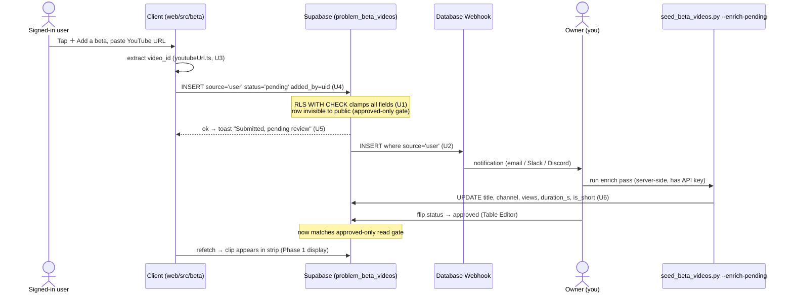

# Web Beta Videos — Plan

> **Implementation-ready.** Product intent (WHAT) was resolved in a `grill-me` session on
> 2026-07-10, *validated against live YouTube data* (two throwaway pilots — see
> [Pilot evidence](#pilot-evidence--why-scraping-is-the-right-call)). Split into **Phase 1**
> (benchmark seed + read-only display) and **Phase 2** (user submissions + moderation).
>
> **Status (2026-07-13):** ✅ **Phase 1 shipped** in PR #76 (migration `0010`,
> `scripts/seed_beta_videos.py`, `web/src/beta/*`) — see [Phase 1 HOW](#implementation-plan-phase-1-how).
> 🔜 **Phase 2 is now planned** — the HOW lives in
> [Phase 2 Implementation Plan](#implementation-plan-phase-2-how) (U1–U6). Two forks were
> resolved on 2026-07-13: moderation is **Supabase-dashboard-based + a submission
> notification** (no in-app queue UI, OQ4), and R6's metadata fetch moves **server-side**
> because the API key never ships to the client (see [R6 note](#phase-2--user-submissions--moderation)).

## Goal Capsule

- **Objective:** On a problem, show a **Beta videos** section — a horizontal-scroll strip of
  short climbing-beta clips other people filmed — so a climber stuck on a problem can watch how
  it's done. Solve the **cold-start** (nothing to show on day one, no users yet) by
  **pre-seeding** benchmark problems from YouTube via the **official Data API** — starting with
  the app's default board, **Mini MoonBoard 2025** — then let users contribute the long tail later.
- **Product authority:** the user (solo builder of the Boardhang PWA). Decisions below were
  resolved in the 2026-07-10 grill and are backed by pilot data, not assumption.
- **Open blockers:** none for Phase 1. Needs a YouTube Data API key (kept in an env var /
  secret, never committed). Phase 2 needs a moderation surface that does not exist yet, hence
  the phase split.

## Pilot evidence — why "scraping" is the right call

The original question was *scrape vs. only-user-uploaded*. Two throwaway pilots against the live
YouTube Data API (scripts in scratchpad, not committed) settled it with data:

- **Matching works.** Query `"<name> moonboard 2019"` + a confidence gate ("normalized problem
  name ∈ video title") gave **79/80 confident, correct matches** on the top-80 most-repeated
  2019 benchmarks (**98%**). The one miss was a Japanese-named problem (`ポテチ`).
- **Mini 2025 (the default board) is also seedable.** A follow-up probe with the
  `"<name> moonboard mini 2025"` query hit **5/5 confident matches** on the top Mini 2025
  benchmarks — a channel systematically films them. Only the head was checked (quota-limited); the
  tail is unvalidated (see DQ3), and Mini 2025's lower repeats / more-generic names lean harder on
  the R1 manual-review gate.
- **The risk is recall, not precision.** The failure mode is *no match* (non-Latin / generic
  names), never *wrong match*. A miss just means "no video yet" — safe. This inverts the initial
  fear that auto-matching would mislead climbers.
- **The content is Shorts.** 79/79 confident matches were **≤60 s vertical Shorts**. A
  Shorts-first UI isn't a constraint we impose — it's what the beta ecosystem *is*. The only
  long results were multi-problem *compilations* (noise); a Shorts-length bias raises precision.
- **This is not scraping.** We use the **official YouTube Data API** to discover video IDs and
  the **official iframe/thumbnail** to display them — with channel attribution. Instagram is
  deferred (no usable public search API; scraping it would be ToS-hostile).
  ⚠️ **Storage-policy check (pre-ship):** the pilot validated *matching*, not *storage*. Confirm
  the YouTube API Services Developer Policies permit persisting `title`/`channel`/`views`; if not,
  store only `video_id` + `source_catalog_id` and **hydrate title/channel/views at render time**
  (or commit to a documented refresh cadence). See [Deferred / Open Questions](#deferred--open-questions).

**Conclusion:** seed benchmarks from the API for a *warm* cold-start with *correct* videos;
user submissions fill the long tail (Phase 2). Scrape-vs-upload was a false binary — do both.

## Context — what already exists

- **Problem model (`0006`, `web/src/catalog/*`):** `catalog_problems` keyed by
  `source_catalog_id` (UUIDv5, globally unique **across board and angle** — the natural FK for a
  video). Fields include `name`, `grade`, `repeats`, `is_benchmark`, `setter`. Public-read/anon,
  seeded server-side by `scripts/import_catalog.py`; client caches per (`layout_id`, `angle`)
  slab in IndexedDB.
- **Detail surface:** the problem detail is a **drawer** (`web/src/catalog/ProblemDetail.tsx`),
  deep-linkable via `?problem=<source_catalog_id>` (`catalogSearch.ts`,
  `useProblemDrawer.ts`) — so every problem already has a shareable URL. The action buttons
  (Connect & light up, Log try / Log ascent) live at the bottom of the drawer.
- **UGC template to mirror:** `list_problems` (`0003`) — a `source_catalog_id` +
  `added_by` + soft-delete + sync-friendly table. The closest existing shape for
  `problem_beta_videos`.
- **Reusable client pieces:** `components/ui/skeleton.tsx` (loading shimmer);
  `sessions/memberAscentsStore.ts` (on-demand pull + max-age cache pattern) as the store
  template; `supabase/client.ts` (anon read client).
- **Seed tooling precedent:** `scripts/import_catalog.py` — a one-off server-side Python
  importer that upserts into a public-read table. The beta seed is the same shape.

## Product Contract

### Phase 1 — Benchmark seed + read-only display

- **R1 — Seed benchmarks from the official API.** A one-off server-side script queries YouTube
  for benchmark problems and writes confident matches into `problem_beta_videos` as
  `source='seed', status='approved'`. Query = `"<emoji-stripped name> moonboard 2019"`;
  **confidence gate** = normalized problem name (`[^A-Z0-9]` stripped, uppercased) is a
  substring of the normalized video title. **Auto-accepted for distinctive names** — the gate's
  ~98% match rate (with ~zero wrong matches) earns it there. **Short / common-word names fall
  below a specificity threshold and route to mandatory manual review** instead of auto-accept,
  because the substring test can false-match a generic name against an unrelated title. Raw
  candidates are dumped to JSON, and the spot-check is required for any low-specificity name.
- **R2 — Beta section in the drawer.** `ProblemDetail.tsx` gains a **Beta videos** section, a
  **horizontal-scroll** strip of portrait cards, placed at the **very bottom of the drawer,
  below** the Log try / Log ascent buttons. Each card = portrait **thumbnail**
  (`img.youtube.com/vi/<video_id>/hqdefault.jpg`, **zero API quota**) + channel name +
  ▶/duration badge + provider glyph. Note `hqdefault.jpg` is a 480×360 **landscape** frame
  (vertical Shorts are pillarboxed), so the portrait card **object-cover-crops** it; a
  broken/placeholder thumbnail (deleted video) **hides the card** rather than showing a gray box.
- **R3 — Tap → player sheet.** Tapping a card opens a **full-screen player sheet** with a single
  YouTube **iframe** (mounted only on tap — a 5-beta problem is never 5 live players). Matches
  the vertical Shorts viewing experience.
  - **Sheet states:** (a) iframe-loading placeholder over the thumbnail, (b) unavailable /
    embedding-blocked fallback with a **"Watch on YouTube"** out-link (embedding is often
    disabled on Shorts), (c) playing.
  - **Dismissal:** top-left close button + swipe-down + scrim tap; the OS/browser **back gesture
    closes the sheet first**, without popping the `?problem=` drawer or changing the URL.
  - **Single-video for now** — tapping a card views that one clip; a swipeable Shorts-style pager
    across a problem's betas is deferred (see [Deferred / Open Questions](#deferred--open-questions)).
- **R4 — Ordering: most-watched first.** Betas render **`views` desc** — the most-watched clip
  is usually the clearest/canonical beta.
- **R5 — Four explicit states.** The section always renders (advertises the feature, and becomes
  the Phase-2 contribution hook), with:
  1. **Loading** — header + 2–3 shimmer skeleton portrait cards (reuse `ui/skeleton.tsx`).
  2. **Has videos** — the carousel (R2).
  3. **Empty** — Phase 1: a single centered "No beta videos yet." slot. Phase 2 (per **U5**,
     authoritative): a persistent **`＋ Add a beta`** button beside the section header, shown in
     *both* the empty and populated states (not the empty slot transforming into a one-off "add
     the first beta" entry). The empty copy stays alongside the CTA.
  4. **Error** — a **distinct** slot from Empty: "Couldn't load beta videos" + a **"Try again"**
     action that re-runs the `betaStore` fetch, so a transient network failure is recoverable in
     place (not indistinguishable from a genuinely video-less problem).

### Phase 2 — User submissions + moderation

> Planned 2026-07-13 (HOW in [Phase 2 Implementation Plan](#implementation-plan-phase-2-how)).
> **R8's dedupe mechanism already shipped in `0010`** (Phase 1) — only R6 (submission) and R7
> (moderation) need new work.

- **R6 — Submit a beta.** A signed-in user pastes a YouTube URL on a problem; the app extracts
  the video ID and inserts a row with `source='user', status='pending'`.
  - ⚠️ **Resolved 2026-07-13 — metadata fetch is server-side, not client-side.** The original
    wording ("the app fetches title/channel/duration via the API") conflicts with the hard
    constraint that **the YouTube Data API key never ships to the client** (KTD4, Non-goals).
    Resolution: the client inserts **only the `video_id`** (the schema defaults `title`/`channel`
    to `''`, `duration_s` nullable); a **server-side enrich pass** (extended
    `scripts/seed_beta_videos.py`, where the key already lives) fills `title`, `channel`, `views`,
    `duration_s`, `is_short` before/at approval. Instagram submission stays deferred (Non-goals);
    Phase 2 is YouTube-only. See **U3–U6**.
- **R7 — Review queue (moderation).** Submissions are **hidden until approved** — the display
  query only returns `status='approved'`. The owner (you) approves/rejects a pending row. This is
  the safe path chosen over trust-on-submit precisely because the confidence gate that protects
  the seed does **not** protect arbitrary user URLs.
  - ✅ **Resolved 2026-07-13 (OQ4) — dashboard moderation + a submission notification.** No
    in-app moderation queue UI is built (there is no admin/owner concept in the app today, and a
    solo builder at low volume does not warrant one). The owner **approves** by flipping
    `status='approved'` in the **Supabase Table Editor** *after* running the server-side enrich
    pass, and **rejects** by setting `status='rejected', deleted=true` (both — a status-only
    reject strands the dedupe tuple; see U2 runbook / R8, #2). A **submission notification** — a
    source-filtered `AFTER INSERT` trigger, not a bare dashboard webhook (which can't row-filter,
    #3) — pings the owner; the U6 enrich pass, which lists every pending row, is the authoritative
    backstop if a notification is dropped. See **U1** (write path), **U2** (notification +
    runbook), **U5** (submit UI), **U6** (enrich + reconciliation).
  - ⚠️ **Moderation-scaling tripwire (#9).** The dashboard+script loop is deliberately sized for
    low volume — the case where the feature is *not yet* succeeding. It does not scale with the
    long-tail contribution it aims to unlock. **Tripwire:** if pending submissions exceed ~20 at
    once **or** ~10/week sustained, revisit **path C** (auto-enrich via a `pg_net` trigger /
    Edge Function — removes the manual script step) and/or an in-app moderation queue. Owner
    watches the U6 pending-queue count; "if volume grows" now has a number, not a vibe.
- **R8 — Attribution & dedupe.** Every card credits the channel and links out; a **partial**
  unique index on `(source_catalog_id, provider, video_id) where not deleted` stops the same clip
  being attached twice (seed + user, or two users) while still allowing a removed/rejected clip to
  be re-added later. ✅ **Shipped in `0010`** (Phase 1) — no new schema for R8.
  - ⚠️ **The "re-added later" promise holds only if reject soft-deletes (#2).** Because the index
    is `where not deleted`, a rejected row that keeps `deleted=false` stays in the index and the
    clip becomes permanently un-addable. Rejection must set `deleted=true` (see U2 runbook / R7).

### Key technical decisions (KTD)

- **KTD1 — FK is `source_catalog_id`.** A video attaches to one specific (layout, angle) climb.
  ⚠️ **Confirm at build:** `0006`'s header asserts `source_catalog_id` is unique across angles,
  but `fetch_boardsesh.py` has a comment implying a problem's uuid is *stable across angles*.
  This does **not** change the schema (same FK either way) — it only decides whether the 40° seed
  also covers 25° or each angle is seeded separately. Phase-1 pilot used the **40° slab** (the
  standard, most-filmed angle); seed 40° first regardless.
- **KTD2 — Status gate is the trust boundary.** The public display query is *always*
  `status='approved' AND NOT deleted`. Seed rows land approved; user rows land pending. One
  column carries the entire seed-vs-queue distinction — no separate tables.
- **KTD3 — Thumbnails are free, iframes are lazy.** Cards use static thumbnail images (no quota,
  no player weight); an iframe mounts only inside the player sheet on tap. Keeps a
  many-beta drawer cheap on a phone.
- **KTD4 — Seed runs server-side, offline of the app.** The seed is a `import_catalog.py`-style
  one-off that upserts into a public-read table — **not** a live runtime job. No API key ships in
  the client; the client only ever reads `problem_beta_videos` (anon) and hits YouTube's public
  thumbnail/iframe endpoints.

## Implementation Plan (Phase 1 — HOW)

> ✅ **Shipped in PR #76.** Retained for provenance; the Phase 2 HOW is
> [below](#implementation-plan-phase-2-how).

### 1. Migration `0010_problem_beta_videos.sql` (Supabase — safety-critical, `effort: max`, test-first)

```
create table public.problem_beta_videos (
  id                uuid        primary key default gen_random_uuid(),
  source_catalog_id text        not null,            -- FK-by-convention to catalog_problems (KTD1)
  provider          text        not null default 'youtube'
                                 check (provider in ('youtube','instagram')),
  video_id          text        not null,
  title             text        not null,
  channel           text        not null,
  duration_s        int,
  is_short          boolean     not null default false,
  views             bigint      not null default 0,
  source            text        not null check (source in ('seed','user')),
  status            text        not null default 'pending'
                                 check (status in ('approved','pending','rejected')),
  added_by          uuid        references auth.users(id),   -- null for seed
  created_at        timestamptz not null default now(),
  deleted           boolean     not null default false
);
-- R8 dedupe as a PARTIAL unique index so a rejected/soft-deleted clip can be re-added later
-- (mirrors 0003's list_problems partial index; a full table constraint would permanently
--  occupy the tuple after a hand-reject or removal).
create unique index on public.problem_beta_videos (source_catalog_id, provider, video_id)
  where not deleted;
create index on public.problem_beta_videos (source_catalog_id) where not deleted;
```

- **RLS:**
  - **Public read** is **approved-only**: `select` policy `status = 'approved' and not deleted`
    (anon). Pending/rejected rows are never anon-readable (KTD2).
  - **Phase 1:** no client write policy at all — seed is written server-side with the service
    role, exactly like `catalog_problems`.
  - **Phase 2:** add an `insert` policy allowing a signed-in user to insert **only**
    `source='user', status='pending', added_by = auth.uid()` (a `with check` clamps all three);
    approve/reject is owner/service-role only. Defer this policy to the Phase-2 migration.
- Follow the repo's manual SQL-Editor apply convention in the migration footer. Test RLS via the
  throwaway-Postgres + auth-stub approach (no local Supabase) per project practice.

### 2. Seed script `scripts/seed_beta_videos.py` (server-side, resumable daily batch)

- Harvest the validated pilot into a real seed. **Parametrized by board + query suffix** (not
  hardcoded): Phase 1 targets the default board **Mini 2025** — reads
  `catalog-data/minimoonboard2025_40.json` with suffix `"moonboard mini 2025"`; **2019 Masters**
  (`moonboardmasters2019_40.json`, suffix `"moonboard 2019"`) is a later run. Filters
  `isBenchmark`, sorts by `repeats`, and for each:
  1. `search.list` (`q="<strip_symbols(name)> <board query suffix>"`, `type=video`, `maxResults=5`).
  2. `videos.list` (`contentDetails,statistics`) for duration + views; tag `is_short = dur ≤ 60`.
  3. Keep the first candidate passing the confidence gate. **Distinctive names auto-accept**
     (`status='approved'`); **short / common-word names are held for manual review** (below the
     specificity threshold — the substring gate can false-match generic titles).
- **Resumable / checkpointed.** The script **tracks which problems are already imported vs.
  pending** (a persisted cursor / `repeats`-rank checkpoint) and processes the **next ~100 per
  run**, so a daily run picks up where the last left off and coverage grows over time without
  redoing work. It also **periodically re-validates stored `video_id`s** and soft-deletes dead
  ones (covers seed rot — deleted / privated videos).
- **Idempotent upsert.** The PK is a random `uuid`, so the upsert must target the composite key
  explicitly (PostgREST `?on_conflict=source_catalog_id,provider,video_id`). This **diverges from
  `import_catalog.py`'s PK-merge**, which would 409 on re-run.
- **Quota:** `search.list` = 100 units; free quota 10,000/day = **100 searches/day** ⇒ one ~100
  per-run batch is a day's quota; ~6 runs cover all 540 benchmarks (or request a quota bump).
  `videos.list` batches up to 50 ids/call (1 unit), so it's negligible. Log what was skipped.
- `YOUTUBE_API_KEY` from env; **never committed**. Reuse the pilot's `strip_symbols`/`norm`
  helpers.

### 3. Client — read store + types (`web/src/beta/`)

- `betaTypes.ts` — `BetaVideo` interface mirroring the approved-readable columns.
- `betaStore.ts` — an on-demand pull modeled on `sessions/memberAscentsStore.ts`: fetch
  `problem_beta_videos` where `source_catalog_id = ?` (anon client, `status='approved'` enforced
  by RLS, `order by views desc`), with a small **per-session in-memory cache** keyed by
  `source_catalog_id` so re-opening a problem is instant. No IndexedDB/offline persistence in v1.

### 4. Client — UI (`web/src/beta/BetaVideos.tsx`, mounted in `ProblemDetail.tsx`)

- `<BetaVideos sourceCatalogId>` rendered at the **bottom** of the drawer, below the action
  buttons (R2). Implements the four states (R5) with `ui/skeleton.tsx` for loading.
- `BetaCard` — portrait thumbnail + channel + duration/▶ + provider glyph; `onClick` opens
  `BetaPlayerSheet` (R3) with a single lazy `<iframe>`. Follow the repo input/style idioms
  (`text-base md:text-sm`; verify with `oxlint` + `tsc -b`/`npm run build`, **never** Prettier).
- Empty/error slots per R5 (Phase 1 copy only; leave a clear seam for the Phase-2 submit CTA).
- **Accessibility:** the player sheet **traps focus and returns it to the originating card** on
  close; each `BetaCard` is a **labelled button** ("Beta by ‹channel›, ‹duration›"); the strip is
  **keyboard-scrollable** with its role/label set.

### 5. Verification

- `npm run build` (= `tsc -b`) + `oxlint` in `web/`. Unit-test `betaStore` (cache + ordering) and
  `BetaVideos` state rendering, matching the `*.test.tsx` neighbors.
- Drive it in the browser (`/ce-test-browser`): open a seeded benchmark (e.g. Easy Does It on
  Mini 2025) → strip shows thumbnails → tap → player sheet plays; open a non-seeded problem →
  empty state; throttle network → skeleton.

---

## Implementation Plan (Phase 2 — HOW)

> 🔜 **Planned 2026-07-13.** User submissions (R6) + dashboard moderation with a notification
> (R7) + attribution/dedupe (R8, already in `0010`). YouTube-only. Six units, dependency-ordered.
> **Product Contract preservation:** R6/R7 unchanged in intent; both carry a 2026-07-13
> resolution note (R6 metadata → server-side; R7 → dashboard + notification). No product scope
> changed.

**Requirements trace:** R6 → U1, U3, U4, U5, U6 · R7 → U1, U2, U5, U6 (+ dashboard action) ·
R8 → U1 (dedupe index already shipped in `0010`).

**Dependency order:** U1, U3 have no deps · U2 → U1 · U4 → U1, U3 · U5 → U4 · U6 → U1.

### High-Level Technical Design — submission → approval flow



### U1. Migration `0011_beta_user_submissions.sql` — user-submission INSERT policy

- **Goal:** Open the single write seam Phase 1 deliberately left closed — let a signed-in user
  insert a **pending user** beta row, and nothing else. This is the R7 trust boundary in RLS.
- **Requirements:** R6 (write path), R7 (pending-only, clamp), R8 (dedupe already enforced by
  `0010`'s partial unique index — no schema change needed).
- **Dependencies:** none (extends `0010`).
- **Files:** `supabase/migrations/0011_beta_user_submissions.sql`,
  `supabase/migrations/tests/0011_beta_user_submissions_rls.sql`,
  `supabase/migrations/tests/run_rls_test.sh` (add `0011` to the enumerated run if it lists
  migrations).
- **Approach:** Add one insert policy, mirroring `0003`'s `list_problems` insert policy
  (`for insert to authenticated with check (…)`). The clamp must pin **every** column the client
  is supposed to leave to the server — not just the trust fields — so "the client inserts only
  `video_id`" is a DB-enforced invariant, not a UI convention:
  ```
  create policy "Signed-in users submit a pending beta"
    on public.problem_beta_videos for insert to authenticated
    with check (
      source     = 'user'
      and status = 'pending'
      and provider = 'youtube'
      and added_by = auth.uid()
      and not deleted
      -- metadata MUST originate from the trusted enrich pass (U6), never the client (#1):
      and title = '' and channel = '' and views = 0
      and is_short = false and duration_s is null
    );
  ```
  No UPDATE/DELETE policy for users — approval/rejection and soft-delete stay service-role /
  dashboard only, so the moderation boundary is unbreakable from the client. The clamp is the
  whole security surface: a user cannot self-approve (`status='pending'` forced), cannot
  impersonate (`added_by=auth.uid()`), cannot smuggle a seed row, cannot resurrect a
  soft-deleted tombstone, **and cannot forge attribution/views** (metadata columns pinned empty,
  so U6's enrich — which only backfills empty fields — always owns them; #1).
- **Rate limit (#4):** cap concurrent pending submissions per user so a scripted account can't
  flood the table and the U2 notification channel. Enforce in a `BEFORE INSERT` trigger (RLS
  `with check` can't easily self-count): `raise` / reject when
  `(select count(*) from problem_beta_videos where added_by = auth.uid() and status = 'pending'
  and not deleted) >= N` (start N≈10). Trigger, not policy, so the limit is one place and testable.
- **`video_id` format (FYI):** add a defense-in-depth CHECK so a direct-API insert can't store a
  malformed id even though the client extractor (U3) already validates it:
  `alter table public.problem_beta_videos add constraint problem_beta_videos_video_id_fmt
  check (video_id ~ '^[A-Za-z0-9_-]{11}$');` (the approval gate remains the primary control).
- **Patterns to follow:** `supabase/migrations/0003_collaborative_lists.sql` insert policy;
  `0010`'s header + manual-apply footer convention; the auth-stub harness in
  `supabase/migrations/tests/stub_supabase.sql`.
- **Execution note:** **Safety-critical (`supabase/migrations/**`) → `effort: max`, test-first.**
  Write the RLS assertions before the policy; run via `supabase/migrations/tests/run_rls_test.sh`
  (throwaway Postgres + auth stub — no local Supabase).
- **Test scenarios** (extend the `0010` RLS-test style):
  - Authenticated user inserts `source='user', status='pending', provider='youtube',
    added_by=self` → **succeeds**; the row is then **invisible** to both anon and authenticated
    reads (approved-only gate from `0010` still holds).
  - Insert with `status='approved'` → **denied** (cannot self-approve).
  - Insert with `status='pending'` but `added_by=<other uuid>` → **denied** (no impersonation).
  - Insert with `source='seed'` → **denied** (cannot forge a seed row).
  - Insert with `provider='instagram'` → **denied** (YouTube-only in Phase 2).
  - Insert with `deleted=true` → **denied**.
  - Insert with a non-empty `channel`/`title`, non-zero `views`, `is_short=true`, or a non-null
    `duration_s` → **denied** (#1 — metadata forgery blocked; only the enrich pass may set these).
  - Insert with a malformed `video_id` (not `^[A-Za-z0-9_-]{11}$`) → **denied** by the CHECK.
  - An `(N+1)`th pending insert by the same user while N are still pending → **denied** by the
    rate-limit trigger (#4); after one is approved/rejected, a new insert **succeeds**.
  - Authenticated `UPDATE`/`DELETE` on any row still affects **zero rows** (no policy) — the
    `0010` assertion must continue to pass unchanged.
  - Anon insert still **denied**.
  - Partial-unique dedupe (`0010`) still blocks a duplicate **live** clip on the user path
    (submitting a `video_id` already live for that problem raises `23505`).

### U2. Submission notification + moderation runbook

- **Goal:** Ping the owner when a user submits, so a `pending` row is surfaced — **but treat the
  notification as a convenience nudge, not the system of record** (#3): the authoritative
  discovery path is the enrich pass in U6, which selects every pending row regardless of whether
  any notification was delivered.
- **Requirements:** R7 (the "+ notification" half of the resolved moderation surface).
- **Dependencies:** U1 (rows must be insertable first).
- **Files:** `supabase/migrations/0011_beta_user_submissions.sql` (the trigger, alongside U1) +
  the moderation runbook documented in the migration footer and a short note in
  `docs/social-accounts-login-SETUP.md` (or the beta subsystem doc).
- **Approach — source-filtered trigger, not a bare dashboard webhook (#3):** A dashboard Database
  Webhook fires on **every** insert (its UI has no row-condition field), so a webhook on
  `problem_beta_videos` INSERT would also ping ~100× during a seed batch. Use a Postgres
  `AFTER INSERT ... FOR EACH ROW WHEN (new.source = 'user')` trigger calling
  `pg_net`/`net.http_post` to the owner's channel (email relay / Slack / Discord incoming webhook)
  so only real submissions notify. The webhook URL is a configured secret (Vault / DB setting),
  not committed.
- **Backstop — the enrich pass is the reconciliation list (#3):** because notification delivery
  can fail silently (expired hook, spam filter, 500), the owner's routine is: run
  `seed_beta_videos.py --enrich-pending` (U6), which **prints the full pending queue** — that
  list, not the notification, is what guarantees no submission is stranded.
- **Moderation runbook (#2) — document these snippets in the `0011` footer:**
  - **Approve:** `update problem_beta_videos set status='approved' where id = '<id>';`
    (only after the enrich pass has filled `channel`/`duration_s` — see U6).
  - **Reject:** `update problem_beta_videos set status='rejected', deleted=true where id='<id>';`
    — reject **must** set `deleted=true`, not `status` alone. The dedupe index is
    `where not deleted`, so a status-only reject leaves the tuple occupied and the clip becomes
    permanently un-addable (see U1 / R8, #2).
- **Test expectation: none (ops/config).** Smoke-verify once: submit a beta on staging → the
  trigger fires exactly once (and does **not** fire on a seed insert); confirm the notification
  arrives; confirm `--enrich-pending` lists the pending row even with the webhook disabled.

### U3. `youtubeUrl.ts` — client-side URL → `video_id` extractor

- **Goal:** Turn a pasted YouTube URL into an 11-char `video_id` (or `null`), entirely
  client-side — there is no existing helper (the seed script takes the id straight from the API).
- **Requirements:** R6 (the client's only parsing responsibility).
- **Dependencies:** none (pure function).
- **Files:** `web/src/beta/youtubeUrl.ts`, `web/src/beta/youtubeUrl.test.ts`.
- **Approach:** A pure `extractYouTubeId(input: string): string | null`. Trim, tolerate a bare id,
  parse the URL and match the known shapes: `youtu.be/<id>`, `watch?v=<id>`, `/shorts/<id>`,
  `/embed/<id>`, `/live/<id>`. Strip extra query params and fragments. Validate the id against
  `^[A-Za-z0-9_-]{11}$`; return `null` on any non-YouTube host or malformed id. The stored id
  flows straight into the existing `BetaCard` thumbnail and `BetaPlayerSheet` embed templates —
  no display work needed.
- **Patterns to follow:** small pure-util + colocated `*.test.ts` (mirror existing `web/src/`
  util tests); house style — no Prettier, verify with `oxlint` + `tsc -b`/`npm run build`.
- **Execution note:** test-first (pure function, cheap to spec exhaustively).
- **Test scenarios:**
  - Each URL shape (`youtu.be`, `watch?v=`, `/shorts/`, `/embed/`, `/live/`) → correct id.
  - `watch?v=<id>&t=30s&list=…` (extra params) → id only.
  - Trailing slash / fragment (`#t=1m`) → id only.
  - Bare 11-char id passed directly → returned as-is.
  - Non-YouTube host (`vimeo.com/…`, `instagram.com/…`) → `null`.
  - Empty / whitespace / garbage / wrong-length id → `null`.
  - Leading/trailing whitespace around a valid URL → trimmed, id returned.

### U4. `submitBeta` — the user-submission store write

- **Goal:** Insert a pending user row from the client, with correct clamped fields and friendly
  error handling; do **not** touch the approved-videos cache (the row is invisible until approved).
- **Requirements:** R6.
- **Dependencies:** U1 (INSERT policy), U3 (id extractor).
- **Files:** `web/src/beta/betaStore.ts` (add `submitBeta`), `web/src/beta/betaStore.test.ts`.
- **Approach:** `async submitBeta(sourceCatalogId: string, videoId: string): Promise<void>`
  modeled on `listsStore.addProblem` (the closest UGC-insert analog):
  - Guard `if (!supabase)` → throw the not-configured message.
  - Resolve `userId` via `supabase.auth.getSession()` (mirror `listsStore.currentUserId()`); throw
    "You need to be signed in…" if absent.
  - `insert({ source_catalog_id, provider: 'youtube', video_id: videoId, source: 'user',
    status: 'pending', added_by: userId })`.
  - On Postgres `23505` (duplicate live clip via the `0010` partial index) → throw a friendly
    "This video can't be added again for this problem." (FYI — avoid "already added": a dup can be
    a *pending* row the submitter can't see, so don't assert a visible clip.) Surface other errors
    verbatim.
  - **Do not** insert into the `cache` map — the pending row is not approved, so it must not
    appear in the strip; the UI shows a "pending review" toast instead. No `refetchBeta` needed.
- **Patterns to follow:** `web/src/lists/listsStore.ts` `addProblem` (`added_by = auth.uid()`
  client-side, 23505 handling); `betaStore.ts`'s existing `supabase`/error idioms.
- **Test scenarios:**
  - Unconfigured build (`supabase === null`) → throws not-configured; no network.
  - Not signed in → throws the signed-in error; no insert attempted.
  - Happy path → insert called with exactly `source='user', status='pending',
    provider='youtube', added_by=<session uid>, video_id`.
  - `23505` from the client → friendly "already added" message.
  - Generic insert error → surfaced.
  - Success does **not** mutate the approved-videos cache (re-render shows no new card).

### U5. Submit CTA + `BetaSubmitDrawer` — the UI

- **Goal:** A `＋ Add a beta` entry in the Beta section (empty **and** populated states) that
  gates on sign-in, opens a URL-submission drawer, validates, submits, and confirms.
- **Requirements:** R6, R7 (advertises the contribution hook the Phase-1 empty state reserved).
- **Dependencies:** U4.
- **Files:** `web/src/beta/BetaSubmitDrawer.tsx`, `web/src/beta/BetaSubmitDrawer.test.tsx`,
  edit `web/src/beta/BetaVideos.tsx`.
- **CTA placement — authoritative over R5 (#6):** the single `＋ Add a beta` button lives beside
  the "Beta videos" `<h2>` and renders in **both** the empty and has-videos states. This
  supersedes R5's Phase-2 line about the empty *slot itself* becoming a `＋ Add the first beta`
  entry; R5 has been updated to match. One label everywhere: `＋ Add a beta`.
- **Approach:**
  - In `BetaVideos.tsx`, add the header `＋ Add a beta` button (both states — the empty state stops
    being a dead end). Hold `signInOpen` + `submitOpen` + `resume` state locally.
  - On tap: `const signedIn = useAuth().status !== 'signedOut'`; if `!signedIn`, set `resume=true`
    and open `SignInDialog` (reuse `web/src/auth/SignInDialog.tsx` as `ProblemDetail` does); else
    open `BetaSubmitDrawer`.
  - **Sign-in resume (#7):** `SignInDialog` auto-closes itself once the session lands, so copying
    only the gate leaves the user staring at the drawer they wanted, closed. Mirror the **`resume`
    mechanic in `web/src/lists/useAddToList.tsx`**: a `useEffect` keyed on `signedIn` consumes the
    `resume` flag and auto-opens `BetaSubmitDrawer` once signed in; clear `resume` if the sign-in
    dialog is dismissed without success.
  - `BetaSubmitDrawer` = shadcn **`Drawer`** mirroring `web/src/lists/AddToListSheet.tsx`: a
    `<form>` with the shared `@/components/ui/input` (keeps `text-base md:text-sm`, no iOS zoom),
    a submit `Button`, and a synchronous re-entrancy lock (`submittingRef`, per `AddToListSheet`).
    On submit: run `extractYouTubeId`; if `null`, show an inline field error and **do not** call
    the store. On a valid id, call `submitBeta`; on success close the drawer and
    `toast.success("Submitted — it'll appear here once it's reviewed.")`; on failure
    `toast.error(msg, { action: { label: 'Retry', … } })` (the `sonner` idiom from
    `AddToListSheet`).
  - **Inline URL-error state (FYI):** the invalid-URL message is fixed copy
    ("Enter a YouTube video link"), shown below the field; it **clears as the user edits** and
    resets when the drawer closes — matching the field-error rigor the four `BetaVideos` states
    already model.
  - **Pending signal on reopen (#8):** on a successful submit, record a lightweight local flag
    (`localStorage`, keyed by `source_catalog_id`). When `BetaVideos` mounts for a problem the
    user has a pending submission on, show a small "Your beta is pending review" note by the CTA
    so a returning submitter sees progress (instead of the plain empty/populated state) and isn't
    tempted to resubmit a different URL. Purely client-local — no moderation UI, no server read.
  - **A11y:** the CTA is a labelled button; the drawer traps focus and restores it on close
    (shadcn `Drawer` default); the input has an associated label.
- **Patterns to follow:** `web/src/catalog/ProblemDetail.tsx` sign-in gate
  (`if (!signedIn) { setSignInOpen(true); return }` + `<SignInDialog>`);
  **`web/src/lists/useAddToList.tsx`** (the `resume`-after-sign-in mechanic);
  `web/src/lists/AddToListSheet.tsx` (Drawer + form + re-entrancy + toast); `web/CLAUDE.md`
  (shadcn only, `@/` alias, theme tokens).
- **Test scenarios:**
  - Signed-out: tapping ＋ opens `SignInDialog`, not the submit drawer.
  - Signed-out → sign in succeeds → `BetaSubmitDrawer` **auto-opens** (resume, #7); sign-in
    dismissed without success → drawer does **not** open and `resume` is cleared.
  - Signed-in: tapping ＋ opens `BetaSubmitDrawer`.
  - Invalid URL → inline error shown, `submitBeta` **not** called; editing the field clears it.
  - Valid URL → `submitBeta` called with the extracted id; on success drawer closes + success
    toast fires.
  - `submitBeta` rejects → error toast with a Retry action; drawer stays open.
  - Double-submit (rapid double tap / Enter) → guarded to a single insert.
  - CTA renders in **both** empty and has-videos states.
  - After a successful submit, reopening the same problem shows the "pending review" note (#8);
    a different problem does not.

### U6. `seed_beta_videos.py --enrich-pending` — server-side metadata fill

- **Goal:** Fill `title`/`channel`/`views`/`duration_s`/`is_short` for `source='user'` rows using
  the YouTube Data API, server-side — the resolution to R6's key-never-ships constraint.
- **Requirements:** R6 (metadata), R7 (owner's pre-approval step).
- **Dependencies:** U1 (rows exist to enrich).
- **Files:** `scripts/seed_beta_videos.py` (add the `--enrich-pending` mode).
- **Approach:** A new mode that selects `problem_beta_videos where source='user'
  and status in ('pending','approved') and (channel = '' or duration_s is null)` — note it
  includes **approved-but-unenriched** rows too (#5), so an owner who flips `status='approved'`
  before enriching can still repair the blank card; it is not limited to `status='pending'`. It
  batches the selected `video_id`s through `videos.list` and updates each row's `title`,
  `channel`, `views`, `duration_s`, and `is_short` (`dur ≤ 60`).
  - ⚠️ **Fetch `snippet`, not just `contentDetails,statistics` (#5).** The existing `enrich()` in
    `scripts/seed_beta_videos.py` requests only `contentDetails,statistics` (duration + views) —
    it never fetches `snippet` and never writes `title`/`channel`. `channel` is exactly what the
    card credits, so this mode must request `snippet,contentDetails,statistics` (channel/title
    come from `snippet`). "Reuse the existing helper" is not enough here — the part list must be
    extended.
  - Reuse the script's `iso_to_secs`/service-role writer. **Does not approve** — approval stays a
    deliberate manual dashboard action (U2/R7). Idempotent: re-running skips already-filled rows;
    a `video_id` the API no longer returns is left untouched (or logged), never crashed on.
- **Reconciliation output (#3):** the run **prints the full pending queue** it selected (problem,
  video_id, submitter, age) before/after enriching. This list — not the U2 notification — is the
  authoritative "what's waiting for me" surface, so a dropped notification never strands a
  submission.
- **Patterns to follow:** the existing `videos.list` enrichment + `--revalidate` mode in
  `scripts/seed_beta_videos.py` (extend its part list to add `snippet`); env-only
  `YOUTUBE_API_KEY`, never committed.
- **Execution note:** server-side batch, run by the owner as part of moderation; not a runtime job.
- **Test scenarios / verification:** run against a freshly submitted pending row → `channel`,
  `title`, `views`, `duration_s`, `is_short` all populate (proving `snippet` is fetched); an
  **approved-but-blank** row is also picked up and repaired (#5); re-run → no-op (idempotent); a
  bogus/removed `video_id` → skipped and logged, run completes; quota-exhaustion (403/429) exits
  cleanly like the seed mode so it can resume; the run prints the pending queue (#3).

---

## Phase 2 — Verification

- **Migration:** `supabase/migrations/tests/run_rls_test.sh` green with the new `0011` assertions
  (clamp, no impersonation, no self-approve, pending-invisible, update/delete still zero-row).
- **Client:** `npm run build` (= `tsc -b`) + `oxlint` in `web/`; unit tests for `youtubeUrl`,
  `submitBeta`, and `BetaSubmitDrawer` states pass, matching the `*.test.ts(x)` neighbors.
- **End-to-end (`/ce-test-browser`):** signed-out ＋ → sign-in; signed-in ＋ → drawer; paste a
  real Shorts URL → "pending review" toast, no card appears; run `--enrich-pending` + flip
  `status='approved'` in the dashboard → the clip appears in the strip on reopen; confirm the
  submission notification fired.
- **Security spot-check:** with a signed-in session, attempt (via devtools) to insert
  `status='approved'` or another user's `added_by` → rejected by RLS.

---

## Non-goals (this plan)

- **Instagram ingestion** — deferred (no public search API; ToS-hostile to scrape). Schema
  reserves `provider='instagram'` for later user submissions only.
- **iOS** — web PWA only.
- **Automated discovery of *new* betas** — the seed grows via manual daily runs of the resumable
  script; nothing auto-discovers newly-uploaded betas in v1. (The script *does* re-validate
  existing `video_id`s to drop dead ones — that's liveness, not re-discovery.)
- **Realtime, likes/ranking, comments, playlists** — a flat views-desc strip only.
- **Client-side API calls** — the key never ships; the client only reads the table + public
  thumbnails/iframes.

## Success signals

- Opening a seeded benchmark shows a horizontal strip of correct beta Shorts (views-desc); tapping
  one plays it in a full-screen sheet.
- Opening a non-seeded problem shows the "No beta videos yet" empty state (not a blank/broken
  row); a slow network shows skeleton cards first.
- The seed script populates the top-N benchmarks on the seeded board (Mini 2025 first) at high
  coverage with zero wrong matches, all `status='approved'`; a name the query can't match is
  simply absent (no bad row).
- (Phase 2) A signed-in user submits a URL → row lands `pending` → invisible to the public until
  approved from the moderation surface.

## Outstanding Questions (for build)

- **OQ1 — Angle coverage (KTD1).** Confirm whether `source_catalog_id` is shared or distinct
  across 25°/40° before deciding if the 40° seed covers 25°. Resolve against `fetch_boardsesh.py`
  + a quick `catalog_problems` query at build time.
- **OQ2 — Seed batching & quota.** The resumable script runs ~100-search batches/day (one day's
  quota), checkpointed by `repeats` rank; ~6 runs cover all 540 benchmarks, or request a quota
  bump. Phase 1 can ship with just the top ~80–100 seeded.
- **OQ3 — API key hygiene.** Keep the YouTube Data API key in an env var / secret, never
  committed; restrict it to YouTube Data API v3 and add a referrer/IP restriction.
- **OQ4 — Phase-2 moderation surface.** ✅ **Resolved 2026-07-13:** **Supabase-dashboard-based
  moderation + a submission notification** (Database Webhook), no in-app queue UI — there is no
  admin/owner concept in the app today and a solo builder at low volume does not warrant one.
  Owner enriches (U6) then flips `status` in the Table Editor. An in-app queue is a documented
  follow-up if volume grows. See R7 and **U1/U2/U5/U6**.
- **OQ5 — Non-Latin / generic names.** The ~2% the query can't match (e.g. `ポテチ`) — accept as
  user-submission long tail, or add a per-problem manual-ID override list in the seed script?

## Deferred / Open Questions

### From 2026-07-13 ce-doc-review (Phase 2)

- **No watch signal to answer DQ1 (#10, product-lens).** Deferred by choice — Phase 2 ships no
  instrumentation. Consequence to accept knowingly: post-launch, *submission* volume is the only
  signal, and DQ1's original question was about *watching* beta (vs. climbers' existing YouTube/IG
  habit). Low submissions won't distinguish "feature unwanted" from "contribution path
  undiscovered," and nothing captures whether seeded/approved betas are actually watched. If the
  team later wants to answer this, a lightweight "beta opened" counter is the smallest probe.

- **DQ1 — User demand unproven** (product-lens). The pilot retired the *technical* risk (98%
  match), not the *demand* risk: is in-app beta wanted vs. climbers' existing YouTube/IG habit?
  Consider a thin instrumented probe (e.g. a "watch beta" deep-link) before investing further.
  - **Decision 2026-07-13:** owner accepted the demand risk — Phase 2 ships in full **without** a
    gating instrumentation probe. Revisit if submission volume is low post-launch.
- **DQ2 — Seeded board** (feasibility). ✅ **Resolved 2026-07-10:** seed the default board
  **Mini 2025 (layout 7)** first — top-5 benchmarks confirmed on YouTube via a dedicated
  benchmark channel; **2019 Masters** is a later run. The seed script is parametrized by board +
  query suffix. Residual: benchmarks are a minority of the catalog, so non-benchmark *projects*
  still show empty (tracked as the Phase-2 user-submission long tail).
- **DQ3 — Auto-accept calibrated on the head** (adversarial). 98% was measured on the top-80
  benchmarks; re-measure precision/recall on a **tail sample** (rank ~300–400) before trusting
  auto-accept beyond the head. Ties to the specificity threshold in R1.
- **DQ4 — Single-video sheet vs Shorts pager** (design-lens). R3 ships **single-video** for now;
  decide whether the sheet becomes a swipeable pager across a problem's betas (a structurally
  different component). **Still deferred — out of Phase 2 scope** (Phase 2 is submissions +
  moderation, not the viewing experience).
