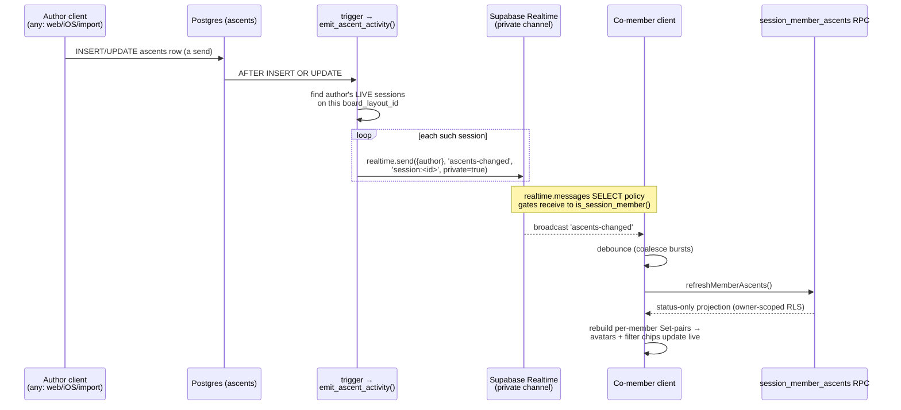

# feat(web): Real-time collab-session "sent problem" updates

> **HOW to build it.** Push a friend's send into every co-member's catalog within seconds,
> replacing the manual refresh. Server-side emission (DB trigger on `ascents`) drives a
> private Supabase Broadcast channel per session; clients nudge the existing
> `refreshMemberAscents()` RPC on receipt. The security posture is unchanged — `ascents`
> stays owner-only and cross-member data keeps flowing solely through the minimal
> `session_member_ascents` projection; the broadcast carries **no ascent data**.

---

## Summary

Today the collab-session catalog is pull-only: a member's send lands in Postgres `ascents`,
and co-members only see it when their client re-runs `session_member_ascents(p_session_id)` —
on session activation, tab foreground, or the manual refresh icon in
`web/src/catalog/SessionBar.tsx`. This plan adds a push path so the catalog reflects a
friend's send within seconds without a manual refresh.

The transport is **Supabase Broadcast used as a nudge**, emitted **server-side** from a
Postgres trigger on `ascents`. The trigger fans out a payload-light "changed" signal to the
private channel of each **live** session on the ascent's board that the author belongs to.
Co-members subscribed to that channel debounce-refetch via the existing
`refreshMemberAscents()`. Nothing about the cross-member data path changes: the nudge is a
content-free doorbell; the actual sent/tried sets still arrive only through the owner-scoped,
status-only RPC.

Two forward-compatible choices are made now so a future friend-scoped **Feed** is additive,
not a rewrite (see Scope Boundaries → Deferred): emission lives at the **DB layer** (one
canonical "a send happened" event source), and channel authorization uses the
**private-channel + `realtime.messages` RLS** pattern the Feed will reuse with a friendship
predicate instead of a membership one.

---

## Problem Frame

- **Symptom.** In an active session, when a co-member logs a send, the current user sees it
  only after tapping the refresh icon on the session bar (`SessionBar.tsx` → `refresh` →
  `refreshMemberAscents()` + `refreshActiveSession()`). Until then the catalog's "who sent
  this" avatars (`useMemberSenders`) and per-member filter chips (`useSessionFilterRows`) are
  stale.
- **Root cause.** There is no push path. `memberAscentsStore` pulls on exactly three triggers
  (active-session change, `visibilitychange→visible`, explicit refresh) and self-drops at a
  5-minute max-age. No Supabase Realtime exists anywhere in the codebase yet — this is a
  greenfield transport.
- **Constraint that shapes the design.** `ascents` RLS is deliberately owner-only (migration
  `0002`); cross-member reads never relax it — they flow only through the minimal-projection
  `session_member_ascents` SECURITY DEFINER RPC (`0007`). `postgres_changes` on `ascents`
  would stream RLS-filtered raw rows (either nothing, or forcing an RLS relaxation) and is
  therefore rejected. Broadcast-as-nudge preserves the projection boundary.

---

## Requirements

- **R1 — Live sent-problem updates.** While a session is active, a co-member's new send (or
  edit/removal that changes sent/tried status) is reflected in the current user's catalog
  within a few seconds, with no manual refresh.
- **R2 — No data-path change.** Cross-member sent/tried data continues to flow **only**
  through `session_member_ascents`. The broadcast payload carries no ascent content (no
  problem ids, grades, comments, dates, tries) — at most a coarse "changed" marker and the
  author's user id.
- **R3 — Membership-gated channel.** Only current members of a session may receive its
  broadcasts. Authorization reuses the app's membership gate (`is_session_member`), enforced
  server-side via RLS — not by channel-name obscurity.
- **R4 — Board- and liveness-scoped emission.** A send nudges only sessions that are **live**
  (`deleted = false AND expires_at > now()`) and whose `board_layout_id` matches the ascent's
  board. A send on a board no session covers nudges nobody.
- **R5 — Emission independent of the sender's UI.** The nudge fires whenever an `ascents` row
  is written, regardless of which client wrote it (web upsert, iOS sync, logbook import) or
  whether the sender is currently viewing the session. (This is what server-side emission
  buys over client-side, and what the future Feed requires.)
- **R6 — Graceful degradation.** If Realtime is unconfigured, the socket drops, or a nudge is
  missed, behavior falls back to today's pull model. The existing 5-minute max-age drop and
  foreground refetch remain as the safety net; nothing regresses.
- **R7 — Bounded refetch.** Bursts of sends (e.g. accumulating tries, or several members
  logging at once) coalesce into a debounced refetch rather than one RPC call per event.
- **R8 — Clean teardown.** The channel is opened on session activation and closed on session
  change, leave, end, expiry, and sign-out — no leaked subscriptions, no cross-session bleed.

---

## Key Technical Decisions

- **KTD-1 — Broadcast, not `postgres_changes`.** Use Supabase Broadcast as a content-free
  nudge; the client refetches through the existing RPC. `postgres_changes` on `ascents` is
  rejected because it enforces `ascents` RLS (owner-only), which would either deliver nothing
  to co-members or force relaxing the owner-only posture that `0007` deliberately preserves.
- **KTD-2 — Server-side emission (DB trigger).** Emit from an `AFTER INSERT OR UPDATE` trigger
  on `ascents`, not from the client. Rationale: (a) fires regardless of the sender's client or
  UI context (R5); (b) is the single canonical event source a future Feed reuses; (c) a
  client-side emit is a dead-end for the Feed and misses cross-device / import writes. Chosen
  over client-side broadcast.
- **KTD-3 — Reusable emit helper, session-only fan-out today.** The trigger calls a small
  helper `public.emit_ascent_activity(p_user_id, p_board_layout_id)` that owns the fan-out.
  Today it loops the author's live sessions on that board and `realtime.send(...)`s each. The
  Feed later adds one more `realtime.send(...)` to the author's own feed channel — an additive
  branch, not a rewrite. Build the seam now; do **not** build the Feed fan-out.
- **KTD-4 — Private channel authorized by `realtime.messages` RLS.** Channels are private,
  keyed `session:<session_id>`. A **SELECT** policy on `realtime.messages` authorizes *receive*
  for members only, via `is_session_member(<parsed session id>, auth.uid())`. Because emission
  is server-side, clients never *send* on the channel, so **no INSERT policy is needed** — the
  attack surface is receive-only. This is the exact pattern the Feed reuses with an
  `is_friend(...)`-style predicate.
- **KTD-5 — Nudge → refetch, single source of truth.** On receipt, clients call
  `refreshMemberAscents()` (debounced). The payload is never trusted as data; the RPC remains
  the only way sent/tried sets enter the client. This keeps one source of truth and means a
  malformed or spoofed payload can at worst trigger a redundant authorized refetch.
- **KTD-6 — Pull model stays as the floor.** Realtime is strictly additive. `activateMember`
  activation, `visibilitychange` refetch, manual `SessionBar` refresh, and the 5-minute
  max-age drop all remain. Realtime failing silently degrades to exactly today's behavior (R6).

---

## High-Level Technical Design

Emission and delivery across the send author, Postgres, Realtime, and a co-member client:

The nudge (dashed, RT→M) carries no ascent content; the actual data (M→RPC) still travels the
unchanged owner-scoped projection path.

---

## Scope Boundaries

**In scope**

- A migration adding the emit helper, the `ascents` trigger, and the `realtime.messages`
  receive policy for private `session:<id>` channels.
- A client Realtime subscription module that opens/closes the private channel on the active
  session lifecycle and debounce-refetches on nudge.
- Wiring that lifecycle to the existing active-session signal and tearing it down on
  leave/end/expiry/sign-out.

**Deferred to Follow-Up Work**

- **The friend-scoped Feed page.** Blocked on infrastructure that does not exist yet: a
  friend/follow relationship (no friend graph is in the schema — every "friend" mention in
  migrations is an aspirational comment), a friend-scoped read path over `ascents`, and its
  RLS. When built, it reuses this plan's two seams: `emit_ascent_activity` adds a fan-out to
  the author's feed channel, and the `realtime.messages` policy adds a friendship-gated clause
  for `feed:<id>` topics. The Feed does **not** need a new activity/events table — `ascents` is
  already persisted and timestamped, so the feed is "query my friends' ascents newest-first,
  with realtime prepending." The Feed's own channel topology (per-user vs per-friend fan-out)
  is a Feed-plan decision this work does not foreclose.
- **Live presence** ("who is online in the session now") via Supabase Presence on the same
  channel — a natural companion, out of scope here.
- **Scheduled hard-delete / cron sweep** of expired sessions (already deferred by `0007`).

**Out of scope (non-goals)**

- Relaxing `ascents` RLS or widening the `session_member_ascents` projection.
- Trusting broadcast payloads as a data channel (KTD-5 forbids it).
- Any change to iOS. The trigger is server-side and benefits iOS peers automatically for
  emission, but no iOS client subscription is built here.

---

## Implementation Units

### U1. Migration: server-side ascent-activity emission + private session-channel authorization

**Goal.** Add the backend substrate: a reusable emit helper, an `ascents` trigger that calls
it, and a `realtime.messages` receive policy that authorizes members-only delivery on private
`session:<id>` channels. Advances R2, R3, R4, R5; establishes the KTD-2/3/4 seams.

**Requirements.** R2, R3, R4, R5.

**Dependencies.** None (builds on `0002` `ascents`, `0007` `sessions`/`session_members`/
`is_session_member`).

**Files.**
- `supabase/migrations/0012_session_realtime.sql` (new) — next free slot after `0011`.
- `supabase/migrations/tests/0012_session_realtime.test.sql` (new, or the repo's existing
  migration-test harness convention under `supabase/migrations/tests/`).
- `supabase/migrations/0007_collaboration_sessions.sql` (reference only — mirror its helper
  style, `search_path` pinning, and header-comment discipline).

**Approach.**
- `public.emit_ascent_activity(p_user_id uuid, p_board_layout_id int)` — `SECURITY DEFINER`,
  pinned `search_path`. Selects the author's **live** sessions (`deleted = false AND
  expires_at > now()`) whose `board_layout_id = p_board_layout_id`, and for each calls
  `realtime.send(payload, 'ascents-changed', 'session:' || session_id, true)` (private=true).
  Payload is minimal — e.g. `jsonb_build_object('author', p_user_id)` — carrying **no** ascent
  content (R2). This function is the KTD-3 extension seam: document in a header comment that a
  future Feed adds a second `realtime.send(... 'feed:' || p_user_id ...)` here.
- Trigger `ascents_emit_activity` — `AFTER INSERT OR UPDATE ON public.ascents FOR EACH ROW`,
  calls `emit_ascent_activity(new.user_id, new.board_layout_id)`. Firing on UPDATE covers a
  flipped `sent`, an edited row, and a soft-delete (`deleted = true`) so removed sends also
  refresh co-members. Keep it cheap; the fan-out query is indexed by `session_members_user_idx`
  and `sessions_owner_idx`.
- `realtime.messages` **SELECT** policy — authorizes *receive* on broadcast messages whose
  topic matches `session:<uuid>` when `is_session_member(<parsed uuid>, auth.uid())`. Parse the
  id from `realtime.topic()` (directional: `split_part(realtime.topic(), ':', 2)::uuid`, guarded
  by a `topic LIKE 'session:%'` and `extension = 'broadcast'` check). No INSERT policy —
  clients never send (KTD-4).
- Header comment must state the manual apply/verify step (mirror `0007`'s footer): apply and
  verify **before** shipping the client bundle, since this is a cross-user data path.

**Execution note.** Safety-critical (`supabase/migrations/**`) — plan and implement test-first
at `effort: max`. **Testing gotcha:** the repo has no local Supabase, and `realtime.send` /
`realtime.messages` live in the Supabase-only `realtime` schema, absent from a throwaway
vanilla Postgres (see the project's migration-local-testing approach). Test the trigger by
**stubbing** a `realtime.send(...)` function in the test harness that records its arguments
into a temp table, then assert the trigger invoked it with the right topic(s) and payload for
the right sessions. Test the authorization predicate logic (`is_session_member` over a parsed
topic) directly as a boolean, decoupled from the `realtime.messages` policy binding.

**Patterns to follow.** `0007` `is_session_member` (DEFINER, pinned `search_path`, STABLE),
its owner-seat trigger shape, and its liveness predicate (`deleted = false AND expires_at >
now()`) repeated in the WHERE.

**Test scenarios.**
- Author in one live session on board B, inserts a send on board B → `realtime.send` recorded
  once for `session:<that id>`, payload contains only `author`, no problem/grade/comment.
- Author in a session on board B, inserts a send on board C (no session) → **no** send recorded
  (R4 board scope).
- Author in an **expired** session (`expires_at <= now()`) → no send recorded (R4 liveness).
- Author in a **soft-deleted** session (`deleted = true`) → no send recorded.
- Author in two live sessions on board B → two sends recorded, one per session id.
- UPDATE flipping `sent` false→true → trigger fires (send recorded).
- UPDATE setting `deleted = true` (removal) → trigger fires so co-members refetch and drop it.
- Payload assertion: recorded payload has no key other than `author` — enforces R2 at the
  emission boundary.
- Authorization predicate: `is_session_member(topic-parsed id, member uid)` → true for a
  member, false for a non-member and for a malformed / non-`session:` topic.
- `Covers R2.` Emission never includes ascent content.

**Verification.** Applied to a throwaway Postgres with the harness stubs, all trigger/predicate
tests pass; header documents the manual apply-and-verify-before-deploy step.

---

### U2. Client Realtime subscription module

**Goal.** A `sessionRealtime` module that, for a given active session id, opens the private
`session:<id>` broadcast channel, debounce-refetches `refreshMemberAscents()` on
`ascents-changed`, and tears down cleanly. Advances R1, R5 (consumer side), R7.

**Requirements.** R1, R7.

**Dependencies.** U1 (channel + authorization must exist server-side to receive).

**Files.**
- `web/src/sessions/sessionRealtime.ts` (new).
- `web/src/sessions/sessionRealtime.test.ts` (new).
- `web/src/supabase/client.ts` (reference — the shared, possibly-null client).
- `web/src/sessions/memberAscentsStore.ts` (reference — `refreshMemberAscents`, and the
  `activate/deactivate` + null-client-graceful lifecycle shape to mirror).

**Approach.**
- Mirror `memberAscentsStore`'s imperative lifecycle: `activateSessionRealtime(sessionId |
  null)` opens `supabase.channel('session:' + id, { config: { private: true } })`, subscribes
  to broadcast event `ascents-changed`, and `deactivate` (`sessionId = null`) removes the
  channel. Idempotent on same-id calls (guard like `activateMemberAscents`).
- **Private-channel auth.** Before subscribing, ensure the Realtime socket carries the user
  JWT (`supabase.realtime.setAuth(...)` with the current access token); re-set on token
  refresh. Without it, a private channel subscribe is unauthorized. Note this is the one piece
  of Realtime plumbing the codebase has never needed before.
- **Debounce (R7).** Coalesce nudges within a short window (~500–1000ms) into a single
  `refreshMemberAscents()`; drop the author's-own nudge if the payload `author` equals the
  current user id (self-sends don't change the cross-member projection for the author).
- **Graceful null (R6).** If `supabase` is null (unconfigured), `activate` is a no-op — exactly
  like `memberAscentsStore.fetchMemberAscents`'s unconfigured branch. Never throw.

**Execution note.** Unit-test with a fake Supabase channel (a `vi.fn()`-backed `channel()` that
captures the `on`/`subscribe` handlers) so tests can drive `ascents-changed` synchronously and
assert the debounced refetch; no live socket.

**Patterns to follow.** `memberAscentsStore.ts` module-singleton + `activate/deactivate`
pattern; its null-client graceful branch.

**Test scenarios.**
- `activate(id)` with configured client → opens a channel named `session:<id>` with
  `private: true` and subscribes to `ascents-changed`.
- Receiving one `ascents-changed` → calls `refreshMemberAscents()` once (after the debounce
  window).
- Receiving three nudges within the debounce window → `refreshMemberAscents()` called once, not
  three times (R7).
- Nudge whose payload `author` == current user id → **no** refetch (self-send skip).
- `activate(null)` / re-`activate(otherId)` → previous channel removed before opening the new
  one; no leaked subscription.
- `supabase` null (unconfigured) → `activate` no-ops, never throws (R6).
- Same-id re-activate → no duplicate channel.

**Verification.** Fake-channel tests pass; driving a nudge triggers exactly one debounced,
deduped refetch; teardown removes the channel.

---

### U3. Wire the Realtime lifecycle to the active session + teardown

**Goal.** Drive `activateSessionRealtime` off the same active-session signal that already
drives `useMemberAscents`, and ensure it tears down on session change, leave, end, expiry, and
sign-out. Advances R1, R6, R8.

**Requirements.** R1, R6, R8.

**Dependencies.** U2.

**Files.**
- `web/src/catalog/CatalogScreen.tsx` (reference `:117` — `useMemberAscents(sessionForBoard?.id
  ?? null)`; the same `sessionForBoard?.id ?? null` is the activation signal).
- `web/src/sessions/memberAscentsStore.ts` **or** a small new hook in
  `web/src/sessions/sessionRealtime.ts` (e.g. `useSessionRealtime(sessionId)`) — co-activate
  realtime with the member-ascents lifecycle so both share one id source.
- `web/src/sessions/sessionsStore.ts` (reference — `setActiveSession` / the `status: 'idle'`
  clear-on-leave/end/expiry/removal path at the `activeSession = null` sites) to confirm the
  activation signal goes null on every retirement route.
- `web/src/sessions/sessionRealtime.test.ts` (extend) or a small hook test.

**Approach.**
- Prefer the lowest-risk wiring: a `useSessionRealtime(sessionId)` hook (same `useEffect`-on-id
  shape as `useMemberAscents`) mounted wherever `useMemberAscents` already runs, so realtime is
  active exactly when cross-member projection is active and dies with it. Because every session
  retirement in `sessionsStore` funnels `activeSession` to null, the id signal already goes
  null on leave/end/expiry/removal/sign-out — teardown is automatic (R8) if the hook keys on
  that same `sessionForBoard?.id ?? null`.
- Do **not** change `SessionBar`'s manual refresh — it stays as the user-initiated floor and a
  deliberate belt-and-suspenders alongside live updates.
- Keep `memberAscentsStore`'s 5-minute max-age and foreground refetch untouched (R6 floor).

**Execution note.** Verify the full loop against the real app before commit: two signed-in
clients in one session, one logs a send, the other's catalog updates without a manual refresh —
the `verify` skill's end-to-end drive, not just unit tests. This is the one behavior unit tests
can't prove (cross-client socket delivery + authorization).

**Patterns to follow.** `useMemberAscents`'s `useEffect(() => activate(id), [id])` +
`useSyncExternalStore` shape; the `sessionForBoard?.id ?? null` derivation already in
`CatalogScreen`, `useMemberSenders`, and `useSessionFilterRows`.

**Test scenarios.**
- Active session id set → realtime activates for that id (spy on `activateSessionRealtime`).
- Id changes to another session → deactivate old, activate new.
- Id goes null (leave/end/expiry/sign-out) → deactivate; no channel remains.
- Integration (manual/e2e, per Execution note): two clients, one session — a send on client A
  appears on client B's catalog (avatars + filter chips) within seconds, no refresh tap.
  `Covers R1.`
- Regression: with Realtime unconfigured or the socket down, manual refresh and foreground
  refetch still work — no regression from today. `Covers R6.`

**Verification.** Live two-client test shows sub-few-second propagation; retirement routes leave
no open channel; pull-model fallback intact.

---

## System-Wide Impact & Risks

- **New Realtime dependency.** First use of Supabase Realtime in the repo. Requires Realtime
  Authorization enabled on the project and the client passing the JWT to the socket
  (`setAuth`). Mitigation: U2 owns the auth plumbing; R6 guarantees graceful degradation if the
  socket never connects.
- **Trigger on a hot table.** `ascents` writes now fire a trigger. The fan-out query is small
  and indexed, and `realtime.send` is a lightweight insert into `realtime.messages`. Risk is
  low but real on bulk writes (logbook import can insert many rows). Mitigation: keep
  `emit_ascent_activity` minimal; consider (Open Questions) whether bulk import should suppress
  or coalesce emission.
- **Cross-user data path.** Per `0007`'s discipline, apply and verify the migration **before**
  deploying the client bundle that subscribes. The receive policy is the security boundary —
  review it as safety-critical.
- **Payload discipline is load-bearing for R2.** The whole privacy argument rests on the
  payload never carrying ascent content. U1's payload-assertion test guards this at the
  emission boundary; keep it.

---

## Open Questions

- **Bulk import emission.** Should `0008` logbook-import inserts fire the trigger per row, or
  should import suppress/coalesce emission (e.g. a session-variable guard, or a statement-level
  path)? Deferred to implementation once the import write path's volume is measured — a single
  debounced client refetch already absorbs a burst, so per-row emission may be acceptable.
- **`setAuth` timing.** Confirm whether the installed `@supabase/supabase-js` version
  auto-propagates the JWT to the Realtime socket on auth-state change, or whether an explicit
  `setAuth` on token refresh is required. Resolve against the actual dependency version during
  U2.
- **Debounce window.** 500ms vs 1000ms — tune during U3's live test for perceived latency vs
  refetch chatter.

---

## Sources & Research

- `web/src/sessions/memberAscentsStore.ts` — the pull-only projection store (activation,
  foreground refetch, 5-min max-age) this plan pushes into.
- `supabase/migrations/0007_collaboration_sessions.sql` — sessions schema, `is_session_member`,
  liveness predicate, owner-only `ascents` posture, and the projection RPC contract preserved
  here.
- `web/src/logbook/ascents.ts` — the `ascents` write path (upsert/update/soft-delete) the
  trigger fires on.
- `web/src/catalog/SessionBar.tsx` (`refresh`), `web/src/catalog/CatalogScreen.tsx:117`,
  `web/src/catalog/useMemberSenders.ts`, `web/src/catalog/useSessionFilterRows.ts` — the
  consumers whose staleness this removes.
- `web/src/supabase/client.ts` — the shared nullable client; graceful-unconfigured contract.
- Investigation (this session): confirmed **no** Supabase Realtime anywhere in the codebase and
  **no** friend graph in any migration.

---

## Deploy & Rollout

This is a **cross-user data path**, and the backend must lead the client — so ordering is
load-bearing. Do the steps in this order:

1. **Apply migration `0012`** to the Supabase project (SQL Editor → paste + Run, or
   `supabase db push`). Creates the emit helper, the `ascents` trigger, and the
   `realtime.messages` receive policy.
2. **Enable Realtime Authorization for Broadcast** on the project (Realtime settings). Without
   it, private `session:<id>` channels do not authorize and no nudges are delivered — the
   migration's policy is only consulted once Authorization is on.
3. **Verify on the real project before shipping any client** — the fidelity the local RLS
   harness cannot prove (that Supabase evaluates the policy on receive and that `realtime.send`
   relays):
   - Two signed-in members of one live session: one logs a send → the other receives the
     `ascents-changed` broadcast on `session:<id>` and its catalog updates without a manual
     refresh. `Covers R1.`
   - A non-member (or a member of a *different* session) subscribed to that `session:<id>` topic
     receives **nothing** (receive-auth denies). `Covers R3.`
   - The broadcast payload contains only `{ "author": <uuid> }` — no ascent content. `Covers R2.`
4. **Deploy the web bundle** (the `sessionRealtime` subscriber). Deploy is manual via the Vercel
   CLI from `web/` (see `web/CLAUDE.md`) — merging to `main` does **not** ship.

**Safe intermediate states.** Client-before-backend is harmless but pointless: an
unconfigured/disabled channel just delivers no nudges and the UI stays on the pull model (manual
refresh, foreground refetch, 5-min max-age) — today's behavior (R6). The one state to avoid is
shipping the client while telling users it is "live" when Authorization is still off.

**Rollback.** The change degrades safely, so rollback is rarely urgent:
- *Client issue only:* redeploy the previous web bundle. The trigger keeps firing harmlessly
  (broadcasts with no subscribers); nothing else consumes them.
- *Backend issue:* drop the trigger, both functions, and the policy —
  `drop trigger ascents_emit_activity on public.ascents;`
  `drop function public.ascents_emit_activity();`
  `drop function public.emit_ascent_activity(uuid, int);`
  `drop policy "Members receive session broadcasts" on realtime.messages;`
  Subscribed clients then receive no nudges and fall back to the pull model. There is no data
  migration to reverse — the trigger only ever wrote to `realtime.messages` (ephemeral), never
  to `ascents` or any durable table.

---

## Definition of Done

- U1 migration written test-first, all trigger + authorization-predicate tests green against the
  throwaway-Postgres harness with `realtime.send` stubbed; header documents apply-before-deploy.
- U2 subscription module: opens a private `session:<id>` channel, debounce-dedupes refetches,
  skips self-sends, no-ops unconfigured, tears down cleanly — unit tests green.
- U3 lifecycle wired to the active-session id and torn down on every retirement route; manual
  two-client test shows a send propagating to a co-member's catalog within a few seconds with no
  manual refresh; pull-model fallback verified intact.
- No change to `ascents` RLS, the `session_member_ascents` projection, or `SessionBar`'s manual
  refresh. Broadcast payload carries no ascent content.
- `web/` typecheck via `npm run build` / `tsc -b` and `oxlint` clean (no Prettier).
- The two Feed seams (emit helper extension point, private-channel auth pattern) are documented
  in-code so the deferred Feed is additive.
