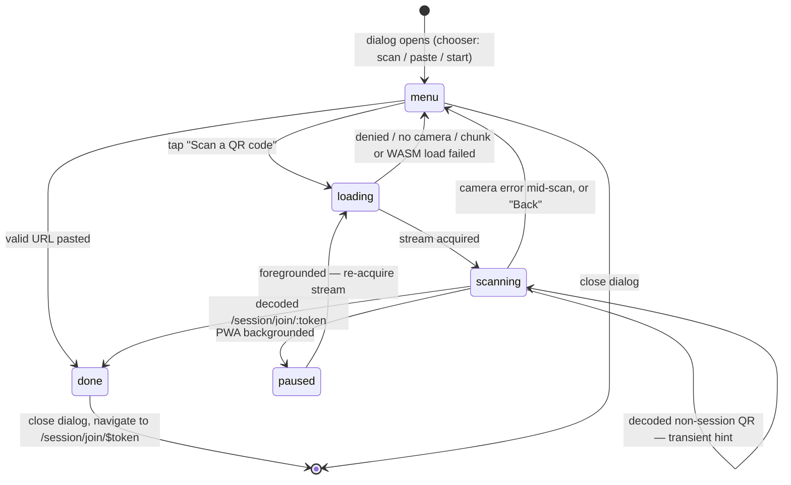

# In-App QR Scan to Join Session - Plan

## Goal Capsule

- **Objective:** Let a joiner scan a session QR code from inside the web PWA — camera opens in an in-app overlay, decodes the join URL, and lands them on the existing `/session/join/$token` flow — instead of leaving the app for the phone's camera app.
- **Authority:** This plan's Product Contract; the collab-sessions origin plan (`docs/plans/2026-07-07-002-feat-web-collab-sessions-plan.md`) for the join flow it must not change (its R8/R9 consent and R15 invite behavior stay intact).
- **Execution profile:** Web PWA only (`web/`). No Supabase, iOS, or BLE surface. Standard tier — plan → work → review → PR.
- **Stop conditions:** Stop and surface if the decoder stack fails to run on iOS Safari in practice, if bundle plumbing (WASM self-hosting) fights vite-plugin-pwa in a way the plan's KTDs don't anticipate, or if any change to the join route's consent behavior seems required.

---

## Product Contract

### Summary

Session sharing already renders a QR of the join URL (`ShareSession`), but the joiner must use their phone's camera app to scan it. This adds an in-app session launcher: the catalog's single `+` button opens a centered dialog with a **chooser** — scan a friend's QR, paste their link, or start your own — and the in-app camera opens only when the user taps "Scan a QR code" (so opening the launcher never prompts for camera permission on its own). A decoded or pasted session QR navigates to the existing join route. The boards overview offers the same launcher join-only (no board context to host in). The scanner is a thin camera→token→navigate layer; auth, consent, and joining stay owned by `/session/join/$token`.

### Problem Frame

The joiner is standing at the wall next to the sharer, often already inside the app. Switching to the camera app, scanning, and tapping a browser banner is friction at exactly the moment the feature should feel social and instant — and for an installed PWA the camera-app scan may open the link in browser Safari rather than the installed app.

### Requirements

**Entry & visibility**

- R1. The catalog `StartBar` shows a single `+` icon button (outline, aria-label "Start or join a session") that opens the launcher; it renders only when no session is active (the existing `StartBar`/`ActiveBar` swap gives this for free). The boards overview shows a "Join a session" button (join-only launcher) that hides while a session is active.
- R2. The launcher's join path is usable while signed out — the join route owns sign-in (token survives via its existing sessionStorage resume). Only the host action ("Start your own session") requires sign-in; it is disabled with a hint when signed out.

**Launcher surface**

- R3. The launcher is a centered dialog (shared `Dialog` primitive) that opens on a **chooser**: a "Scan a QR code" button, a paste-link field, and — when a host action is provided (catalog) — an "or" divider + "Start your own session" button. Tapping "Scan a QR code" reveals the camera viewfinder (framing overlay, rear camera `facingMode: 'environment'`; no torch, no camera-flip in v1) with a "Back" affordance to return to the chooser. The camera starts only on that tap, so opening the launcher does not request camera permission.
- R4. A decoded QR whose URL path matches `/session/join/:token` — **any origin** — closes the dialog and navigates internally to `/session/join/$token`. The scanned origin is never navigated to; only the token is used.
- R5. A decoded QR that is not a session link shows a transient "Not a session code" hint and keeps scanning.
- R6. Joining is never camera-dependent: the paste-link field lives on the chooser alongside the scan option and accepts a join URL (same parser as R4). If the camera is denied or unavailable (or the decoder fails to load offline), scanning drops back to the chooser with a "Camera unavailable — paste the link instead" note; the paste field is right there. An invalid or unparseable pasted value shows the same "Not a session code" feedback as R5's scan miss, without navigating.

**Join semantics (unchanged)**

- R7. After navigation the existing join flow runs untouched: sign-in gate if needed, consent notice (origin R8/R9), `join_session_by_token` RPC, land in the board catalog. The scanner adds no join logic.

**Performance & lifecycle**

- R8. The QR-decode dependency loads only when the launcher opens (dynamic `import()`); catalog and boards bundles are unaffected. The decoder's WASM is self-hosted, never fetched from a third-party CDN.
- R9. The camera stream is fully torn down on dialog close/unmount (no lingering camera-in-use indicator). Backgrounding the PWA and returning re-acquires the stream rather than freezing on the last frame.

### Scope Boundaries

**Non-goals**

- iOS app: sessions don't exist there yet; a native scanner (`VisionKit`) belongs to whatever plan brings sessions to iOS.
- Scan-to-switch mid-session: the affordance is hidden during an active session. Joining another session via a shared *link* while in one keeps today's behavior (seats you and swaps the active session) — unchanged and unadvertised.
- Torch, camera selection UI, and non-QR barcode formats.
- The camera-app scan path stays supported — the QR still encodes a plain URL.

**Deferred to Follow-Up Work**

- Decode-in-worker: the decoder runs on the main thread inside WASM (tens of ms per frame at a throttled scan rate). If jank shows on old phones, the ponyfill can move into a Web Worker later.

---

## Planning Contract

### Consolidated Research

- **Local:** `web/src/sessions/ShareSession.tsx` builds the QR of `${origin}/session/join/${token}` (`buildJoinUrl`); `web/src/sessions/JoinSession.tsx` owns the `/session/join/$token` route (sign-in, consent, join, redirect); `web/src/catalog/SessionBar.tsx` swaps `StartBar` (idle) / `ActiveBar` (active); `web/src/shell/MyBoards.tsx` renders `/boards` and currently reads neither auth nor session state. The shared bottom-sheet is `web/src/components/ui/drawer.tsx` (`@base-ui/react` drawer; `FilterSheet.tsx` is a clean consumer to mirror). The app has **no** `React.lazy`/dynamic-`import()` precedent — this feature establishes it (Vite code-splits automatically). Tests mock browser APIs via `Object.defineProperty(navigator, …)` (see `web/src/sessions/ShareSession.test.tsx` clipboard mock) and mock the router per `web/src/sessions/JoinSession.test.tsx`.
- **External (load-bearing, verified 2026-07):** iOS Safari still ships `BarcodeDetector` disabled — a JS/WASM decoder is mandatory. The actively maintained stack is `barcode-detector` (Sec-ant) over `zxing-wasm` (zxing-cpp; both released 2026-07); `@yudiel/react-qr-scanner` v2.6 wraps it for React 19 with `playsInline`, `facingMode` constraints, and mount/unmount camera lifecycle. Costs: ~50 kB gzip JS + ~433 kB brotli WASM, lazy on first decode; WASM defaults to a jsDelivr fetch and must be overridden to self-host (`prepareZXingModule({ overrides: { locateFile } })`). Alternatives ruled out: nimiq `qr-scanner` (16 kB, worker-based, but abandoned since 2022, weaker decoder), `html5-qrcode`/`jsQR` (abandoned), zxing-js (revived but weaker old-Java-port decoder). iOS PWA camera quirks to design for: permission is re-prompted roughly per launch in standalone mode; backgrounding freezes the stream (must re-acquire on `visibilitychange`/`pageshow`); one active camera stream at a time; `playsinline`+`muted`+`autoplay` required on the video element.

### Key Technical Decisions

- KTD-1. **Decoder stack: `@yudiel/react-qr-scanner` (over `barcode-detector`/`zxing-wasm`).** The only option combining a best-in-class, actively-maintained decoder with React 19 support and correct iOS video handling out of the box. It always uses the WASM ponyfill (no flaky native-`BarcodeDetector` branching), so behavior is identical across iOS/Android/desktop. Runner-up if the wrapper disappoints: drop to `barcode-detector` directly with a hand-rolled hook — same engine, ~100 lines of camera plumbing.
- KTD-2. **Self-host the reader WASM.** Import the binary via Vite `?url` from the hoisted transitive `zxing-wasm` copy and point `prepareZXingModule` (re-exported by `@yudiel/react-qr-scanner`) at it. A PWA must not depend on jsDelivr at scan time. Do **not** declare `zxing-wasm` as a direct dependency — `barcode-detector` pins it to an exact version, and a separately-ranged direct pin could double-install and desync glue from binary. Guard the self-hosting instead: verify a single deduped `zxing-wasm` copy (`npm ls zxing-wasm`) and no jsDelivr reference for the reader WASM in the built output.
- KTD-3. **Exclude the WASM from the service-worker precache** (workbox `globIgnores` in `vite.config.ts`). Precaching would add ~1 MiB to every install for a feature most users touch rarely — and scanning is inherently online anyway (the join RPC needs the network). Because workbox precaches the lazy JS chunk regardless, the WASM prep is a **retryable runtime step** (`ensureDecoder()`, awaited by the scanner loader), not a top-level await: a top-level await would put the whole module record into a permanently-errored state on an offline fetch, so no retry could recover it. `ensureDecoder` memoizes success and clears the memo on failure, so an offline open routes to the R6 fallback and a later retry recovers instead of leaving a viewfinder that silently never decodes. Add a workbox `runtimeCaching` CacheFirst route for `*.wasm` so repeat scanner opens don't re-download ~433 kB and stay decodable offline.
- KTD-4. **The scanner is a thin layer: decode → parse → navigate.** No auth, consent, or join logic; `/session/join/$token` owns all of it (preserves origin R8/R9 with zero duplication). The only scanner-owned states are camera states.
- KTD-5. **Lazy boundary = the scanner content module.** The trigger button and dialog shell are eager (tiny); `qrDecoder.ts` (which imports `@yudiel/react-qr-scanner`) loads via a dynamic `import()` when the dialog opens, with a spinner fallback and an error state (offline load failure → same never-a-dead-end paste fallback as R6). First dynamic import in the app; no Vite config needed for the split itself. The load is driven by a manual `import()`-in-state loader keyed per attempt, **not** `React.lazy`: `React.lazy` memoizes a rejected import permanently, so its retry edge is unrecoverable. The manual loader re-runs `import('./qrDecoder')` then `ensureDecoder()` on each attempt, so retry recovers a previously-failed chunk or WASM fetch.
- KTD-7. **Chooser-first, camera on demand.** The launcher opens on a chooser (scan / paste / optional start) rather than the camera, so merely opening it never triggers the OS camera-permission prompt — the earlier scanner-first variant fired that prompt for everyone, including a would-be host. `getUserMedia` runs only after "Scan a QR code". Paste is a first-class peer of scanning (always visible), which also makes it the natural fallback when the camera is denied or the decoder can't load offline. Scan, paste, and the optional host action live in one `Dialog` (no nested overlays). `ScanToJoin` takes an optional `onStart`/`starting`/`canStart`; when absent (boards overview) the dialog is join-only.
- KTD-6. **One shared parser module for join URLs.** `parseJoinUrl` lives beside a relocated `buildJoinUrl` in `web/src/sessions/joinUrl.ts`, so the QR writer and both readers (scanner, paste input) can't drift.

### High-Level Technical Design

Launcher state machine. The dialog opens on `menu` (the chooser); the camera (lazy chunk + getUserMedia) starts only on "Scan a QR code". Any camera/decoder failure drops back to `menu`, where the paste field always lives.

Flow across components: entry button (`StartBar` `+` / `MyBoards` "Join a session") → `ScanToJoin` dialog chooser → scan (lazy scanner) or paste → `parseJoinUrl` → `navigate({ to: '/session/join/$token' })` → existing `JoinSession` route (sign-in → consent → RPC → catalog). The optional host action calls the caller's `onStart` (createSession) and closes the dialog.

---

## Implementation Units

### U1. Join-URL helpers module

- **Goal:** One module owns building and parsing join URLs so the QR writer and both scan/paste readers agree.
- **Requirements:** R4, R6 (parser half); KTD-6.
- **Dependencies:** none.
- **Files:** `web/src/sessions/joinUrl.ts` (new), `web/src/sessions/joinUrl.test.ts` (new), `web/src/sessions/ShareSession.tsx` (import `buildJoinUrl` from the new module).
- **Approach:** Move `buildJoinUrl` out of `ShareSession.tsx`; add `parseJoinUrl(text: string): string | null` returning the token for any parseable URL whose path matches `/session/join/:token` (origin ignored), `null` otherwise. Tolerate surrounding whitespace and trailing slashes; reject empty tokens.
- **Test scenarios:**
  - Happy: full prod-style URL → token; localhost/preview-origin URL → same token; URL with trailing slash → token; pasted text with surrounding whitespace → token.
  - Edge: bare token string (no URL) → null; `/session/join/` with empty token → null; unrelated URL (same origin, different path) → null; non-URL garbage (Wi-Fi QR payload `WIFI:S:…`) → null.
  - Regression: `buildJoinUrl(t)` round-trips through `parseJoinUrl` → `t`.
- **Verification:** `joinUrl.test.ts` green; `ShareSession.test.tsx` still green after the import move.

### U2. Decoder dependency and build plumbing

- **Goal:** `@yudiel/react-qr-scanner` installed, WASM self-hosted, excluded from the SW precache, and only reachable via a lazy chunk.
- **Requirements:** R8; KTD-1, KTD-2, KTD-3, KTD-5.
- **Dependencies:** none.
- **Files:** `web/package.json`, `web/vite.config.ts`, `web/src/sessions/qrDecoder.ts` (new — the module that imports the scanner lib, wires `prepareZXingModule` to the `?url`-imported WASM asset, and re-exports the `Scanner` component; this file is the dynamic-import boundary).
- **Approach:** `npm i @yudiel/react-qr-scanner` (only this — `zxing-wasm` stays transitive per KTD-2). In `qrDecoder.ts`, import the reader WASM via `?url` from the hoisted `zxing-wasm` copy, import `prepareZXingModule` from `@yudiel/react-qr-scanner`'s re-export, and expose a retryable `ensureDecoder()` that calls `prepareZXingModule({ overrides: { locateFile }, fireImmediately: true })`, memoizing success and clearing its memo on failure (KTD-3). Default-export the `Scanner`. Add workbox `globIgnores` for `**/*.wasm` plus a `runtimeCaching` CacheFirst route for `*.wasm` in the `VitePWA` config.
- **Execution note:** Mostly packaging/config — prefer build-output smoke verification over unit coverage.
- **Test scenarios:** Test expectation: none — build config; proven by U3's integration and the bundle checks below.
- **Verification:** `npm run build` succeeds; `dist/` shows the scanner lib + WASM in a separate chunk not referenced by the entry bundle; the generated SW precache manifest does not list the `.wasm`; `npm ls zxing-wasm` shows a single deduped copy; no jsDelivr reference for the reader WASM in built output; entry-bundle size unchanged (± a trigger button).

### U3. `ScanToJoin` chooser dialog

- **Goal:** The launcher surface: a `Dialog` that opens on a chooser (scan / paste / optional start), starts the camera only on demand, and ends in a navigate (join) or `onStart` (host).
- **Requirements:** R3, R4, R5, R6, R9; KTD-4, KTD-5, KTD-7.
- **Dependencies:** U1, U2.
- **Files:** `web/src/sessions/ScanToJoin.tsx` (new — exports the `ScanToJoin` dialog plus a `ScanToJoinButton` trigger for the join-only boards-overview use), `web/src/sessions/ScanToJoin.test.tsx` (new).
- **Approach:** `Dialog` primitive, centered. Body branches on `phase` (`menu` | `scanning`). The `menu` phase is the chooser: a "Scan a QR code" button (→ `scanning`), an always-visible paste-link field + Join, and — when `onStart` is passed — an "or" divider + "Start your own session" (disabled unless `canStart`; spinner while `starting`). The `scanning` phase mounts a manual `import()`-in-state loader (keyed per `attempt`, **not** `React.lazy` — a rejected import is memoized and can't recover) that awaits `import('./qrDecoder')` then `ensureDecoder()` with a spinner meanwhile; the loaded `Scanner` renders with `constraints={{ facingMode: 'environment' }}` and the framing finder, plus a "Back" to the chooser. On decode: `parseJoinUrl` — token → close dialog, `navigate({ to: '/session/join/$token', params: { token } })`; no token → transient "Not a session code" hint (R5), keep scanning. Paste (menu) uses the same parser: token → navigate; else the same hint (R6). Camera error / offline decoder load failure → back to `menu` with a "Camera unavailable" note (paste always available). Only the `Scanner` mounts in `scanning` (gated on `open`), so closing or leaving `scanning` tears the stream down; on `visibilitychange` hidden pause, on visible re-acquire while scanning (iOS PWA freeze quirk). Reset to `menu` on close.
- **Test scenarios (mock `@/components/ui/dialog` to keep content mounted through close, mock `./qrDecoder` with a fake `Scanner` exposing `onScan`; router mocked per `JoinSession.test.tsx`):**
  - Chooser: on open the "Scan a QR code" button and paste field are present and the camera has NOT started.
  - Happy: tap Scan → fake scanner emits a valid join URL → navigate with the token, dialog closes.
  - Happy: valid URL pasted in the chooser → same navigate (no scanning needed).
  - Edge: scanning a non-session QR → hint visible, no navigate, scanner still mounted.
  - Edge: invalid pasted value → inline hint, no navigate.
  - Error: `qrDecoder` import rejects (offline) after tapping Scan → back on the chooser with the camera-unavailable note and the paste field.
  - Error: scanner reports a camera error → back on the chooser.
  - Error: first scan attempt fails, second succeeds → scanner recovers (proves the per-attempt loader; a memoized rejection would fail this).
  - Host action: absent when `onStart` is not passed; present and invokes `onStart` when passed; disabled when `canStart` is false.
- **Verification:** component tests green; manual smoke on a real iPhone (Safari + installed PWA): tap Scan → scan a live session QR → consent screen; deny camera → chooser's paste path works; background/foreground mid-scan → viewfinder recovers.

### U4. Entry points: StartBar launcher and boards overview

- **Goal:** The idle-state affordances that open `ScanToJoin`.
- **Requirements:** R1, R2, KTD-7.
- **Dependencies:** U3.
- **Files:** `web/src/catalog/SessionBar.tsx`, `web/src/catalog/SessionBar.test.tsx`, `web/src/shell/MyBoards.tsx`, `web/src/shell/MyBoards.test.tsx`.
- **Approach:** `StartBar`: a single `+` outline icon button (aria-label/title "Start or join a session") opens `<ScanToJoin>` with `onStart` (the existing `createSession` flow, which closes the dialog and opens Share), `starting`, and `canStart={signedIn}` — so joining works signed-out and hosting is gated. The old separate scan icon + "Start session" button are replaced. `MyBoards`: a "Join a session" button (`ScanToJoinButton`, join-only) near the top; the component imports `useSessions` (from `web/src/sessions/sessionsStore.ts`) to hide it while a session is active — signed-out users still see it (R2).
- **Test scenarios:**
  - StartBar: the `+` button opens the launcher (chooser visible); "Start your own session" inside it triggers `createSession` and opens Share; that host action is disabled when signed out; the `+` button is absent when a session is active (`ActiveBar` swap).
  - MyBoards: affordance visible with no active session (signed in and signed out); hidden while a session is active.
- **Verification:** both test files green; manual check that the boards overview affordance doesn't disturb the zero-boards empty state.

---

## Verification Contract

| Gate | Command / method | Applies to |
| --- | --- | --- |
| Typecheck + build | `npm run build` in `web/` (`tsc -b && vite build`) — never `tsc --noEmit` | all units |
| Lint | `npm run lint` in `web/` (oxlint; no Prettier) | all units |
| Unit/component tests | `npx vitest run` in `web/` | U1, U3, U4 |
| Bundle checks | inspect `dist/`: lazy chunk exists, `.wasm` absent from SW precache manifest | U2 |
| Device smoke | real iPhone, Safari tab + installed PWA: scan → join; deny camera → paste path; background/foreground recovery | U3, U4 |

The device smoke is mandatory before PR — jsdom cannot prove `getUserMedia`, WASM loading, or the iOS resume quirk.

## Definition of Done

- All four units land with their tests; every Verification Contract gate passes.
- Scanning a live session QR on a real iPhone from inside the app reaches the unchanged consent screen and joins the session.
- The catalog/boards entry bundles carry no scanner-lib bytes (lazy chunk verified).
- `docs/collaboration-sessions.md` documents the in-app scan join path in the same PR (repo doc discipline).
- No abandoned experiments in the diff; single feature branch `feat/web-qr-scan-join` → squash-merge PR.
