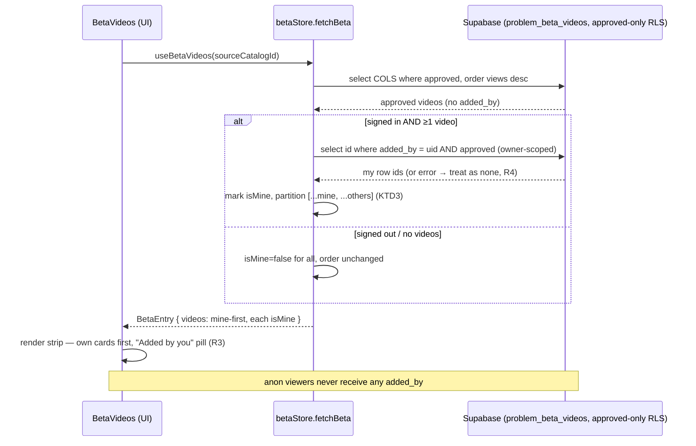

# Web Beta Videos — Surface "your own upload" — Plan

> **Increment on shipped work.** Builds on the Beta Videos feature
> (`docs/plans/2026-07-10-001-feat-web-beta-videos-plan.md`, Phase 1 + Phase 2 shipped —
> `web/src/beta/*`, migrations `0010`/`0011`). This plan adds a per-viewer touch: a signed-in
> user's **own approved** beta clips are pinned first in the strip and marked **"Added by you"**.
>
> **Delivery:** implement on a **new branch in a separate worktree** (per the user's request) —
> handled at handoff via `ce-worktree` + `ce-work`, not encoded in the plan body.

---

## Goal Capsule

- **Objective:** When a signed-in user opens a problem's **Beta videos** strip, any clip **they**
  submitted (and that has since been approved) is (a) **ordered first** in the strip and (b)
  **badged "Added by you"** — so a contributor can find their own beta at a glance and see that it
  landed. Everyone else's view is unchanged.
- **Product authority:** the user (solo builder of the Boardhang PWA).
- **Open blockers:** none. This is a **client-only** change — no schema, no RLS, no migration.

---

## Problem Frame

The shipped strip fetches only public columns (`betaStore.ts` `COLS`) and renders them
**`views` desc** (R4 of the origin plan). It never learns *who* submitted each clip — `added_by`
exists on the row but is deliberately not sent to the client. So today a user who contributed a
beta has no way to recognise their own clip once it's approved: it's mixed into the strip by view
count, visually identical to every other card.

Two facts bound the scope:

1. **Approved-only read.** RLS returns only `status='approved' and not deleted` rows to any client.
   A user's own **pending** upload is invisible server-side and is already represented by the
   local dashed `PendingCard` (localStorage `beta-pending:<id>`). **This plan therefore concerns
   approved uploads only** — the moment an approval turns the pending placeholder into a real card,
   that card should be the one that's pinned + badged.
2. **Ownership is viewer-dependent.** "Mine" is only meaningful for a signed-in identity and must
   never leak to anonymous visitors. We must not expose `added_by` on the public read.

---

## Product Contract

- **R1 — Detect own approved clips (owner-scoped, private).** For a signed-in user, the client
  determines which of a problem's approved beta clips **they** submitted **without** exposing any
  uploader id to anonymous visitors. Anon/signed-out behaviour is byte-for-byte unchanged.
- **R2 — Pin own clips first (per-viewer).** In the strip, the viewer's own approved clips render
  **before** all others. Within the "mine" group and within the "others" group, the existing
  **`views` desc** order is preserved. This is a **per-viewer reorder** layered over R4 of the
  origin plan (most-watched-first) — it changes only the signed-in owner's view; every other
  viewer still sees pure views-desc.
- **R3 — "Added by you" badge.** Each of the viewer's own approved cards shows a small
  **"Added by you"** label, using shadcn/theme tokens, and the ownership is reflected in the card's
  accessible name. Wording is **"Added by you"** (not "Your upload"): the clip's video may be from
  someone else's channel — the card already credits `@channel` — so the label states what is true
  (you *added* it), and matches the Saved Lists ownership vocabulary already used in the app.
- **R4 — Never fail the section over ownership.** If the ownership lookup fails, the strip still
  renders normally (unbadged, plain views-desc). The badge/pin is an enhancement, never a
  dependency of showing betas.
- **R5 — Correct on identity change.** Signing in or out mid-session re-resolves ownership for
  problems reopened afterward (no stale "not mine" from a cache populated under a different
  identity).

**Non-goals:** exposing `added_by` publicly; any migration/RLS/view/RPC change; surfacing a
count/list of "my betas" anywhere else; changing pending behaviour; any change to non-signed-in
rendering.

---

## Key Technical Decisions

- **KTD1 — Owner-scoped second query, not public `added_by`.** When signed in and the main fetch
  returned ≥1 approved clip, run one small extra query for **only the caller's own** approved rows
  on this problem (`select id where source_catalog_id=? and added_by=<uid> and status='approved'
  and deleted=false`) and intersect by row `id`. RLS already permits a user to read approved rows,
  so no policy/schema change is needed, and **no uploader id ever reaches anon clients**. Chosen
  over (a) adding `added_by` to the public column list — which would broadcast every uploader's
  account id to every anonymous visitor to power a cue only the owner sees — and (b) a
  server-computed `is_mine` view/RPC, which would add a safety-critical migration
  (`security_invoker` correctness burden, RLS test harness) for a single boolean. The 2nd query is
  the smallest durable cost.
- **KTD2 — Ownership + ordering live in the store, badge lives in the UI.** `betaStore` owns the
  data truth: it attaches a derived `isMine` flag to each returned video and emits the strip
  **already partitioned** (mine-first, each group in the fetched views-desc order). The component
  stays a pure renderer. This keeps the sort testable in isolation and the card dumb.
- **KTD3 — Partition, don't comparator-sort.** Produce the order as
  `[...mine, ...others]` where each source array is a stable filter of the already-views-desc
  fetch result — rather than a custom `.sort()` comparator — so the DB's view ordering is preserved
  exactly within each group and the result is deterministic regardless of engine sort stability.
- **KTD4 — `isMine` is a viewer-derived field, not a column.** It is set per fetch from the
  session identity and defaults `false` (anon, others, or lookup failure). Documented as such on
  the type so it isn't mistaken for a persisted `problem_beta_videos` column.
- **KTD5 — Identity-change cache invalidation mirrors lists/sessions.** Add
  `syncBetaIdentity(userId)` to `betaStore`, wired into `AuthProvider.resolveSession` alongside the
  existing `syncListsIdentity` / `syncSessionsIdentity` calls, clearing the per-session beta cache
  when the signed-in identity changes so the next open re-resolves ownership. Unlike lists, beta
  data is public, so this is **correctness on auth change**, not cross-account cache *safety* — but
  reusing the established seam keeps identity handling in one recognisable place.

---

## High-Level Technical Design — fetch → ownership → per-viewer order

---

## Implementation Units

**Dependency order:** U1 → U2. U1 is store + types + identity wiring; U2 is the badge/render.

### U1. `betaStore` — owner-scoped ownership, mine-first ordering, identity sync

- **Goal:** Make `useBetaVideos` return each problem's approved clips **partitioned mine-first**,
  each carrying a derived `isMine` flag, resolving ownership via a private owner-scoped query — and
  invalidate the cache on identity change.
- **Requirements:** R1, R2, R4, R5 (KTD1–KTD5).
- **Dependencies:** none.
- **Files:** `web/src/beta/betaTypes.ts`, `web/src/beta/betaStore.ts`,
  `web/src/beta/betaStore.test.ts`, `web/src/auth/AuthProvider.tsx` (wire `syncBetaIdentity`).
- **Approach:**
  - `betaTypes.ts`: add `isMine: boolean` to `BetaVideo`, with a comment that it is a **per-viewer
    derived flag** (set at fetch from the session identity; not a `problem_beta_videos` column;
    defaults `false`). Keep the existing column fields as the DB-mirror contract.
  - `betaStore.ts` `fetchBeta`:
    1. Run the existing approved query unchanged (`COLS`, `status='approved'`, `deleted=false`,
       `order views desc`). Do **not** add `added_by` to `COLS`.
    2. Resolve `userId` via `supabase.auth.getSession()` (the `submitBeta` / `listsStore
       .currentUserId()` idiom). If no `userId` **or** zero videos returned → set every
       `isMine=false`, keep the fetched order, done.
    3. Otherwise run the owner-scoped query: `from('problem_beta_videos').select('id')
       .eq('source_catalog_id', id).eq('added_by', userId).eq('status','approved')
       .eq('deleted', false)`. On **error**, log/swallow and treat the own-set as empty (R4) — the
       section must still render.
    4. Build `ownIds = new Set(rows.map(r => r.id))`; map fetched videos to `{ ...v, isMine:
       ownIds.has(v.id) }`; emit `[...videos.filter(isMine), ...videos.filter(!isMine)]` (KTD3).
    5. Cache/emit the `BetaEntry` as today.
  - Add `syncBetaIdentity(userId: string | null)`: track a module-level `lastIdentity`; on a change
    (including → null), `cache.clear()` + `inflight.clear()` + `notify()`. Same-identity restore =
    no-op. Mirror `syncListsIdentity`'s shape in `web/src/lists/listsStore.ts`.
  - `AuthProvider.tsx` `resolveSession`: call `syncBetaIdentity(session?.user.id ?? null)` next to
    the existing `syncListsIdentity` / `syncSessionsIdentity` calls (best-effort, guarded like its
    neighbours so a failure can't stall auth restore).
- **Patterns to follow:** `web/src/lists/listsStore.ts` (`currentUserId`, `syncListsIdentity`
  identity-clear); the existing `fetchBeta` error/cache idioms; `submitBeta`'s `getSession` use.
- **Execution note:** test-first for the ordering/ownership logic — it's pure once the two query
  results are in hand and cheap to spec exhaustively.
- **Test scenarios:**
  - Signed out → **no** owner-scoped query issued; videos returned in views-desc, all
    `isMine=false` (behaviour unchanged).
  - Signed in, owns none → owner query returns empty; all `isMine=false`; order unchanged.
  - Signed in, owns one clip that is **not** the most-viewed → that clip gets `isMine=true` and is
    moved to **index 0**; the rest keep views-desc.
  - Signed in, owns multiple → all owned clips lead, in views-desc among themselves; others follow
    in views-desc.
  - Owner-scoped query **errors** → main videos still returned (R4), all `isMine=false`, entry
    status `ready` (not `error`).
  - Unconfigured build (`supabase === null`) → `ready` empty, no queries (unchanged).
  - `syncBetaIdentity`: fetch while signed out (cached) → sign in (identity change clears cache) →
    reopening the same problem refetches and marks ownership. Sign-out likewise clears. Restoring
    the **same** identity is a no-op (cache retained).
  - Re-opening a problem under the **same** identity is served from cache (no refetch).

### U2. `BetaVideos` — "Added by you" badge on own cards

- **Goal:** Render the "Added by you" cue on each `isMine` card and reflect it in the card's
  accessible name; own-first ordering already comes from U1 (render in array order).
- **Requirements:** R2 (render order — consume U1's order), R3.
- **Dependencies:** U1.
- **Files:** `web/src/beta/BetaVideos.tsx`, `web/src/beta/BetaVideos.test.tsx`.
- **Approach:**
  - `BetaCard`: when `video.isMine`, render a small **"Added by you"** pill using theme tokens
    (e.g. `bg-primary text-primary-foreground` on a rounded chip), placed **top-left** (top-right
    holds the `YT`/`IG` tag, bottom holds channel + duration, so top-left is free). Reuse the same
    absolute-overlay idiom as the existing tags — no new one-off CSS (per `web/CLAUDE.md`).
  - Extend the card's `aria-label` to append `, added by you` when `isMine`, so the ownership is
    conveyed non-visually.
  - The strip already renders `videos` in array order → **no map change needed** (U1 supplies
    mine-first). `PendingCard` still renders before the video cards.
- **Patterns to follow:** the existing `providerTag` / duration overlay spans in `BetaCard`;
  shadcn/theme tokens (`web/CLAUDE.md`), no ad-hoc hex.
- **Test scenarios:**
  - A card with `isMine=true` shows the "Added by you" pill; its accessible name includes
    "added by you".
  - A card with `isMine=false` shows **no** pill and the unmodified accessible name.
  - Given a store result where an owned clip is first (from U1), the strip renders that card first;
    a `PendingCard`, if present, still precedes all cards.
  - Loading / error / empty states render unchanged (no regression).

---

## Verification

- `npm run build` (= `tsc -b`) + `oxlint` in `web/` — **never** Prettier (repo house style).
- Unit tests: `betaStore.test.ts` (ownership resolution, mine-first partition, error fallback,
  identity-clear) and `BetaVideos.test.tsx` (badge presence/absence, a11y label, own-first render)
  pass, matching the existing `*.test.ts(x)` neighbours.
- Drive it (`/ce-test-browser`): sign in as a user who has an **approved** beta on some problem →
  open that problem → their clip is **first** and badged **"Added by you"**; open a problem where
  they own none → plain views-desc, no badges; sign out → the badge/pin disappears and order is
  pure views-desc; confirm (devtools network) that an **anonymous** load of the same problem never
  receives any `added_by` field.

---

## Definition of Done

- Signed-in owner sees their approved beta(s) first + "Added by you"; all other viewers unchanged.
- No uploader id is present in any anon/public network response for the beta strip.
- Ownership-lookup failure degrades to a normal strip (no section error).
- Sign-in/out mid-session re-resolves ownership on the next problem open.
- `tsc -b` + `oxlint` clean; new unit tests green.

---

## Outstanding Questions (for build)

- **OQ1 — Multiple own clips.** Confirmed in scope: if a user owns several approved betas on one
  problem, **all** lead the strip (views-desc among themselves). No cap.
- **OQ2 — `getSession` cost per fetch (FYI).** `fetchBeta` will call `supabase.auth.getSession()`
  each fetch; it's local/cached in supabase-js, so negligible — but if a cheaper identity handle is
  already threaded nearby at build time, prefer it. Not a blocker.
